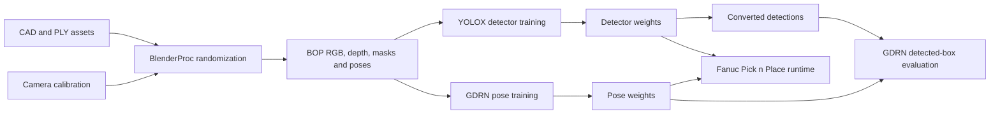
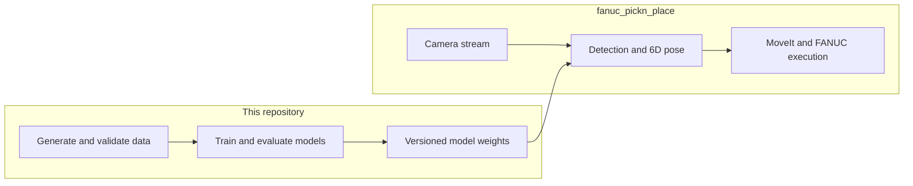

# Synthetic Data YOLO Training & Pose Estimation

[](https://deepwiki.com/DH-ai/synthetic-data-yolo-training_and_pose_estimation)

This repository contains the pipeline for generating synthetic datasets for
object detection and 6D pose estimation. It uses **BlenderProc** to render
photorealistic synthetic scenes (RGB + depth + segmentation masks + pose
labels), **YOLOX** for object detection, and **GDRN** inside the GDRNPP
submodule for pose estimation. Datasets use BOP format and simulation-based
domain randomization for sim-to-real transfer.

It's a part of a larger robot automation project to follow; please refer to [Fanuc Pick n Place](https://github.com/dh-ai/fanuc_pickn_place)

## Features

- Synthetic RGB image generation with BlenderProc
- Instance & semantic segmentation masks
- BOP/COCO annotations consumed by YOLOX
- BOP dataset generation
- 6D pose ground-truth export
- Domain randomization for sim-to-real transfer
- GDRNPP-based 6D pose estimation training & fine-tuning
- Mesh, camera and BOP assets reusable by other pose pipelines

## Workflow



## Scope

This repository ends at the **trained weights**. It is intentionally focused on synthetic data generation and model training/fine-tuning only.

The ROS implementation — robot control, perception nodes, motion planning, and the pick-and-place execution that *consumes* these weights — lives in the separate [Fanuc Pick n Place](https://github.com/dh-ai/fanuc_pickn_place) repository. Keeping it there avoids unnecessarily coupling the data/training pipeline with the runtime ROS stack and keeps each repo simple and single-purpose.



## Getting Started

### Clone with submodules

```bash
git clone --recurse-submodules https://github.com/DH-ai/synthetic-data-yolo-training_and_pose_estimation.git
cd synthetic-data-yolo-training_and_pose_estimation

# If you already cloned without submodules:
git submodule update --init src/gdrnpp src/detectron2
```

`src/gdrnpp` is the [GDRNPP](https://github.com/DH-ai/GDRNPP) fork (YOLOX + GDRN). `src/detectron2` is Detectron2 (needed for GDRNPP builds).

### Two environments

| Stage | Where | What |
|-------|--------|------|
| **Data generation** | CPU or GPU host / Docker | BlenderProc → BOP under `src/output/bop` (or `OUTPUT_DIR_BPROC`) |
| **Training / eval** | GPU machine, conda env `gdrnpp_env` | YOLOX then GDRN inside `src/gdrnpp` |

Generation deps: see [`docker/requirements.txt`](docker/requirements.txt) and [`docs/01_setup.md`](docs/01_setup.md).  
Training install: [`src/gdrnpp/docs/INSTALL.md`](src/gdrnpp/docs/INSTALL.md) and [`docs/03_gdrnpp_submodule.md`](docs/03_gdrnpp_submodule.md).

### Docs (start here)

| Goal | Guide |
|------|--------|
| Full setup | [`docs/01_setup.md`](docs/01_setup.md) |
| Generate synthetic BOP data | [`docs/02_generate_data.md`](docs/02_generate_data.md) |
| Understand architecture and contracts | [`docs/08_architecture.md`](docs/08_architecture.md) |
| Wire custom `mydataset` into GDRNPP | [`docs/04_custom_dataset_mydataset.md`](docs/04_custom_dataset_mydataset.md) |
| Train YOLOX / GDRN | [`docs/05_train_yolox.md`](docs/05_train_yolox.md), [`docs/06_train_gdrn.md`](docs/06_train_gdrn.md) |
| Common failures | [`docs/07_troubleshooting.md`](docs/07_troubleshooting.md) |

Index: [`docs/README.md`](docs/README.md).

### Architecture wikis

- [Parent DeepWiki](https://deepwiki.com/DH-ai/synthetic-data-yolo-training_and_pose_estimation/1-project-overview)
- [GDRNPP DeepWiki](https://deepwiki.com/DH-ai/GDRNPP/1-gdrnpp-modernized-project-overview)