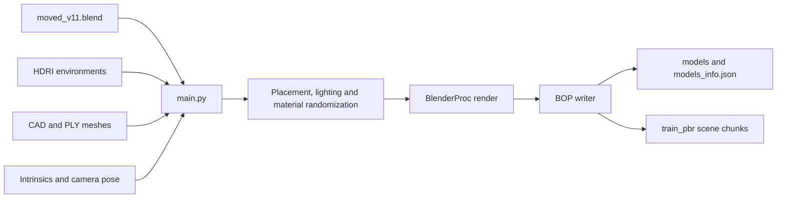
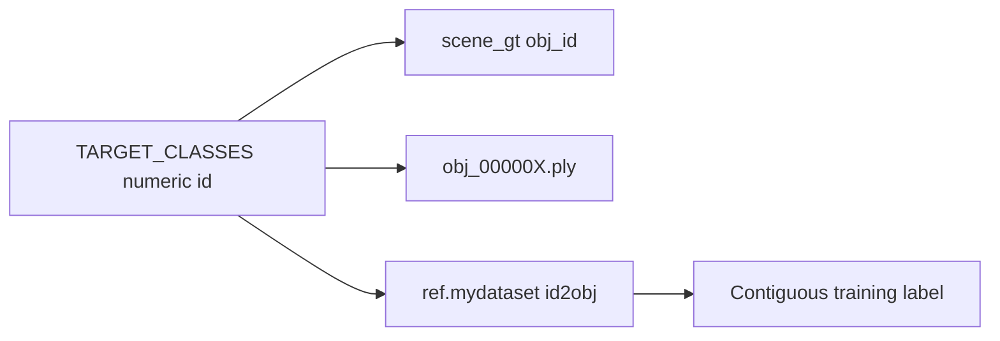
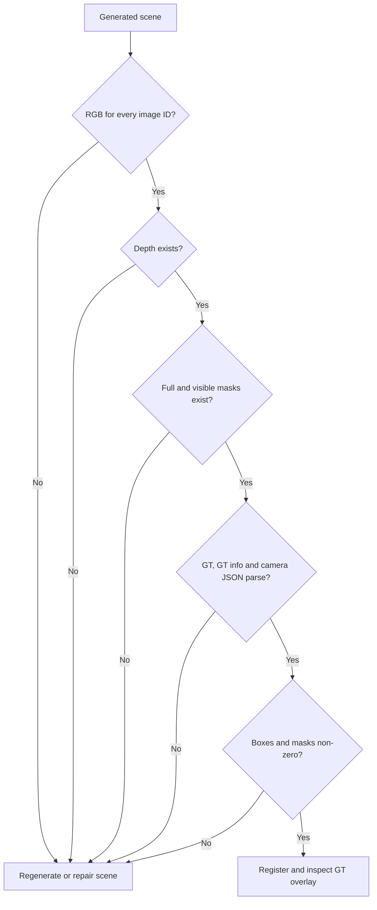

# 02 — Generate synthetic BOP data (BlenderProc)

Produce RGB / depth / masks / pose labels in BOP layout for YOLOX and GDRN.

**DeepWiki:** [BlenderProc pipeline](https://deepwiki.com/DH-ai/synthetic-data-yolo-training_and_pose_estimation/2-blenderproc-pipeline) · [Docker tooling](https://deepwiki.com/DH-ai/synthetic-data-yolo-training_and_pose_estimation/5.1-docker-setup)  
**Also:** [`src/blenderproc_proj/README.md`](../src/blenderproc_proj/README.md)

## Required assets

Paths are relative to the **repo root** (how `main.py` resolves them):

| Asset | Purpose |
|-------|---------|
| `blender_files/moved_v11.blend` (or update `main.py`) | Table / cavity / objects |
| HDRI environment maps | Lighting randomization |
| CAD → exported PLY under the BOP `models/` tree | Mesh + `models_info.json` for BOP |



Object class IDs are defined in `TARGET_CLASSES` inside [`src/blenderproc_proj/main.py`](../src/blenderproc_proj/main.py):

```python
TARGET_CLASSES = {
    "heart": {"id": 1, "patterns": ("heart",)},
    "semi_circle": {"id": 2, "patterns": ("semi circle", "semicircle", ...)},
    "triangle": {"id": 3, "patterns": ("triangle",)},
}
```

Keep these IDs aligned with [`src/gdrnpp/ref/mydataset.py`](../src/gdrnpp/ref/mydataset.py) (`id2obj`) and with `obj_000001.ply` … on disk.

Alignment is by numeric ID; the Blender scene match key (`heart`) does not
need to equal the GDRN display name (`heart_shape`).



Default output directory:

```python
OUTPUT_DIR = os.environ.get("OUTPUT_DIR_BPROC", "src/output/bop")
```

Override with `OUTPUT_DIR_BPROC` if needed.

## Run locally

From the **repo root**, with generation env activated ([01_setup.md](01_setup.md)):

```bash
. .venv/bin/activate

# Headless / no NVIDIA:
export LIBGL_ALWAYS_SOFTWARE=1

# Smoke test (1 frame). First run downloads Blender into ~/blender/.
NUM_ITERATIONS=1 blenderproc run src/blenderproc_proj/main.py

# Larger run
NUM_ITERATIONS=1000 blenderproc run src/blenderproc_proj/main.py
```

`NUM_ITERATIONS` is read in `main.py` (`int(os.environ.get("NUM_ITERATIONS", "1"))`).

### Gotcha: append semantics

The BOP writer **appends** into existing chunk dirs. A crashed/partial run can leave `scene_gt_info.json` missing and the next run fails. Delete the output tree before a clean re-run:

```bash
rm -rf src/output
```

## Run with Docker (GPU host)

```bash
./docker/build.sh
./docker/run.sh 1000          # iterations; default 1000 if omitted
# IMAGE=mytag:latest ./docker/run.sh 100
```

[`docker/run.sh`](../docker/run.sh) mounts the repo and sets `NUM_ITERATIONS` / `PROJECT_DIR` for the container.

## Output contract

After a successful run you should see:

```text
src/output/bop/
  models/
    obj_000001.ply
    obj_000002.ply
    obj_000003.ply
    models_info.json          # must include diameter per object
  train_pbr/
    000000/
      rgb/000000.png
      depth/000000.png
      mask/...
      mask_visib/...
      scene_gt.json
      scene_gt_info.json
      scene_camera.json
    000001/
    ...
```

Camera intrinsics in `main.py` / `ref/mydataset.py` are shared (`K` for 1920×1200).

## Post-generation checklist

1. **PLY vertex normals** — Blender exports often lack `nx/ny/nz`. GDRN’s `meshutil.calc_normals` then hits `IndexError` on triangle-soup fallback. Add normals with the helper (uses Open3D; install `open3d` in the env you use for this step):

   ```bash
   # Edit mdir in the script if your output path differs (default: src/output/bop/models)
   python src/blenderproc_proj/add_vertext_normal.py
   ```

   Note the filename typo: `add_vertext_normal.py` (as committed).

2. **`models_info.json`** — confirm each object id has `diameter` (and other BOP fields your evaluator expects).

3. **Class alignment** — `TARGET_CLASSES` ids ↔ `ref.mydataset.id2obj` ↔ `obj_XXXXXX.ply`.

4. **Image size** — rendered PNGs are 1920×1200; GDRN/YOLOX registration `height`/`width` must match (see [04](04_custom_dataset_mydataset.md), [07](07_troubleshooting.md)).

5. **Mesh units and topology** — GDRN accepts triangular faces. Triangulate
   quads/n-gons before PLY export. Confirm whether PLY coordinates are already
   metres before choosing `vertex_scale`; the historical run used
   `vertex_scale=0.001` on metre meshes and shrank them to roughly `10^-5` m.
   After correcting scale, regenerate `fps_points.pkl`.

## Create a held-out test split

`main.py` writes `train_pbr`; both YOLOX and GDRN register
`mydataset_pbr_test` against `output/bop/test_pbr`. Generate a separate set of
scenes (different random seed / run) into `test_pbr`, or deliberately move a
held-out subset there. Do not duplicate training frames and call them a test
set.

```text
src/output/bop/
  train_pbr/   # training scenes
  test_pbr/    # independent evaluation scenes
  models/
```

There is also a second YOLOX test module targeting `bop/test` +
`test_targets.json`. The dataset factory currently checks `mydataset_pbr`
before `mydataset_pbr_test`, so the name `mydataset_pbr_test` resolves to the
`test_pbr` registration first. Confirm the selected registration in logs.

## Dataset integrity gate

Run this logical gate before a multi-hour GPU job:



Interrupted renders previously produced missing image IDs, masks and malformed
JSON. The resulting `AssertionError`, `KeyError`, or `JSONDecodeError` is a
dataset-integrity failure, not necessarily a loader bug.

## Next

- Install / compile GDRNPP → [03_gdrnpp_submodule.md](03_gdrnpp_submodule.md)
- Register `mydataset` → [04_custom_dataset_mydataset.md](04_custom_dataset_mydataset.md)
