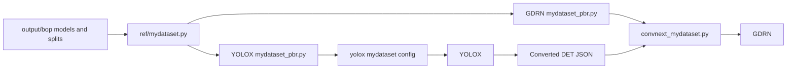
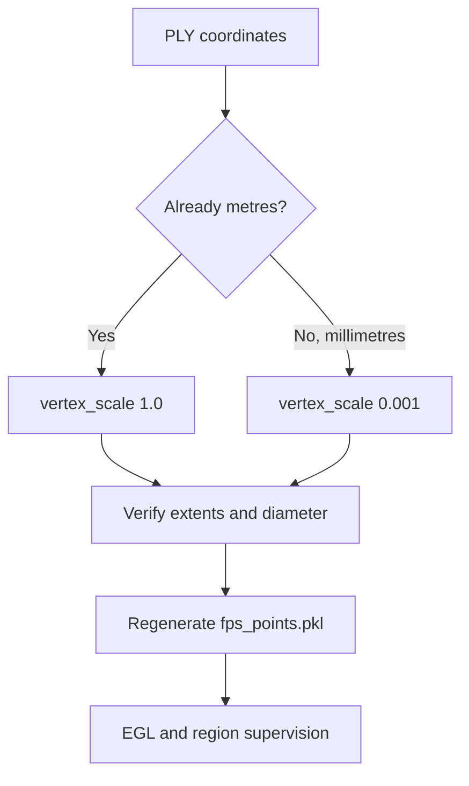

# 04 — Custom dataset (`mydataset`) — main how-to

End-to-end wiring of BlenderProc BOP output into GDRNPP: `ref/`, registration modules, configs, detection files, and PLY normals.

**DeepWiki:** [Custom / BOP datasets](https://deepwiki.com/DH-ai/GDRNPP/4-datasets-and-bop) · [mydataset](https://deepwiki.com/DH-ai/GDRNPP/4.1-custom-dataset-mydataset) · [Configs](https://deepwiki.com/DH-ai/GDRNPP/3-configuration-system)



## Expected on-disk layout

Generation writes (default):

```text
<parent>/src/output/bop/
  models/obj_00000X.ply + models_info.json
  train_pbr/NNNNNN/{rgb,depth,mask,mask_visib,scene_*.json}
```

That matches what `mydataset_pbr` registration expects under `.../output/bop/...`. You do **not** need to copy into `src/gdrnpp/datasets/BOP_DATASETS/`.

Generation only creates `train_pbr`. Create an independent `test_pbr` before
using the committed `mydataset_pbr_test` registration; see
[02_generate_data.md](02_generate_data.md#create-a-held-out-test-split).

## 1. `ref/mydataset.py`

File: [`src/gdrnpp/ref/mydataset.py`](../src/gdrnpp/ref/mydataset.py).

### Point `root_dir` at parent `src/`

The committed file may hardcode a machine path, e.g.:

```python
root_dir = osp.normpath("/mnt/data/work/synthetic-data-yolo-training_and_pose_estimation/src")
data_root = osp.join(root_dir, "output")
bop_root = osp.join(data_root, "bop")
train_dir = osp.join(bop_root, "train_pbr")
model_dir = osp.join(bop_root, "models")
```

Set `root_dir` to the absolute path of the parent repo’s `src/` directory on **your** machine so `output/bop` resolves.

### Keep classes aligned with BlenderProc

```python
id2obj = {
    1: "heart_shape",
    2: "semi_circle",
    3: "triangle_shape",
}
width = 1920
height = 1200
camera_matrix = K  # same K as main.py
```

Names in `id2obj` must match the object name lists used in registration (`objs=`).

### Required fields for EGL / `XYZ_ONLINE=True`

The current `ref/mydataset.py` includes these fields. Verify them rather than
adding duplicates. Older checkouts failed at EGL startup with
`AttributeError: ... no attribute 'texture_paths'`.

Add (adjust `vertex_scale` / z-range to your mesh units):

```python
model_paths = [osp.join(model_dir, "obj_{:06d}.ply").format(_id) for _id in id2obj]
texture_paths = None
model_colors = [((i + 1) * 5, (i + 1) * 5, (i + 1) * 5) for i in range(obj_num)]
vertex_scale = 1.0     # if PLY coordinates are already metres
zNear = 0.25
zFar = 6.0
depth_factor = 1000.0

def get_fps_points():
    fps_points_path = osp.join(model_dir, "fps_points.pkl")
    assert osp.exists(fps_points_path), fps_points_path
    return mmcv.load(fps_points_path)
```

Generate `fps_points.pkl` with the dataset’s FPS tool (hb example: `core/gdrn_modeling/tools/hb/hb_1_compute_fps.py`; use/adapt the mydataset equivalent if present on your branch).

The current file attempts to call the hb FPS helper when the pickle is absent.
That fallback is path-sensitive; verify its output per object. A historical
run found that Blender had already exported metres while
`vertex_scale=0.001` was still applied. Geometry shrank to roughly `10^-5` m.
After correcting scale, regenerate `fps_points.pkl`; the full dataset cache
does not need mesh data regenerated, but stale model caches should be removed.



## 2. Registration modules (filesystem paths live here)

| Role | File |
|------|------|
| GDRN | [`core/gdrn_modeling/datasets/mydataset_pbr.py`](../src/gdrnpp/core/gdrn_modeling/datasets/mydataset_pbr.py) |
| YOLOX train | [`det/yolox/data/datasets/mydataset_pbr.py`](../src/gdrnpp/det/yolox/data/datasets/mydataset_pbr.py) |
| YOLOX test | [`det/yolox/data/datasets/mydataset_pbr_test.py`](../src/gdrnpp/det/yolox/data/datasets/mydataset_pbr_test.py) |

Config `DATASETS.TRAIN = ["mydataset_pbr_train"]` only selects the **name** registered in these modules.

### Current and historical registration pitfalls

Check your checkout for these (they have bitten real runs):

| Symptom / bug | Fix |
|---------------|-----|
| RGB not found / empty dataset | Current loader uses `.png`; older checkouts used `.jpg`. Verify against BlenderProc output. |
| `AttributeError` / wrong ref module | Current GDRN loader still contains `ref.my_dataset` in model loading; correct form is `ref.mydataset`. |
| Bad crops / empty instances | `height`/`width` in the registered dicts must be **1920×1200** (real PNG size), not 960×600. |
| Stale caches | After path/dim fixes, delete `.cache` dataset dict pickles under the configured `cache_dir`. |
| Missing test root | `mydataset_pbr_test` points to `bop/test_pbr`, which generation does not create automatically. |
| Inconsistent test module | A second YOLOX test module targets `bop/test`; factory ordering resolves the shared name from `mydataset_pbr.py` first. |

YOLOX’s current `mydataset_pbr.py` uses `.png` but still declares
`height=600, width=960`. Update those values in the training checkout to
`1200` / `1920`. `Base_DatasetFromList.load_anno` now reads **actual** image
size via PIL (see [07](07_troubleshooting.md)); declared metadata should still
be correct for every other consumer.

Also verify `PROJ_ROOT` / `DATASETS_ROOT` at the top of the registration file point at a directory whose `output/bop` (or equivalent) exists on your machine.

## 3. PLY vertex normals

Before GDRN training with online XYZ:

```bash
# From parent repo root; requires open3d
python src/blenderproc_proj/add_vertext_normal.py
```

Default `mdir = "src/output/bop/models"`. Without normals, expect `IndexError` inside `meshutil.calc_normals`.

## 4. YOLOX config

Existing config:

[`configs/yolox/bop_pbr/yolox_x_1920_augCozyAAEhsv_ranger_30_epochs_mydataset_pbr_mydataset_test_primesense.py`](../src/gdrnpp/configs/yolox/bop_pbr/yolox_x_1920_augCozyAAEhsv_ranger_30_epochs_mydataset_pbr_mydataset_test_primesense.py)

Key fields:

- `model.head.num_classes = 3`
- `DATASETS.TRAIN = ["mydataset_pbr_train"]`
- `DATASETS.TEST = ["mydataset_pbr_test"]`
- `train.init_checkpoint = "pretrained_models/yolox/yolox_x.pth"` (download weights first)

Train/eval commands: [05_train_yolox.md](05_train_yolox.md).

## 5. GDRN config

The current submodule includes:

[`configs/gdrn/mydataset_pbr/convnext_mydataset.py`](../src/gdrnpp/configs/gdrn/mydataset_pbr/convnext_mydataset.py)

It was adapted from:

[`configs/gdrn/hb_pbr/convnext_a6_AugCosyAAEGray_BG05_mlL1_DMask_amodalClipBox_classAware_hb.py`](../src/gdrnpp/configs/gdrn/hb_pbr/convnext_a6_AugCosyAAEGray_BG05_mlL1_DMask_amodalClipBox_classAware_hb.py)

Review these fields before every run:

| Field | mydataset value |
|-------|-----------------|
| `OUTPUT_DIR` | path under `output/gdrn/mydataset_pbr/...` |
| `DATASETS.TRAIN` | `("mydataset_pbr_train",)` |
| `DATASETS.TEST` | `("mydataset_pbr_test",)` (or your registered test name) |
| `MODEL.POSE_NET.NUM_CLASSES` | `3` |
| `MODEL.POSE_NET.XYZ_ONLINE` | `True` |
| `SOLVER.IMS_PER_BATCH` | fit GPU memory (hb uses 48; lower for 1920×1200) |
| `DATASETS.DET_FILES_TEST` | path to **converted** detections JSON (below) |
| `MODEL.LOAD_DETS_TEST` | `True` when using DET files |

The committed config currently has `LOAD_DETS_TEST=False` and
`TEST_BBOX_TYPE="gt"`, so its hb `DET_FILES_TEST` path is inactive during the
GT-box smoke path. **Do not enable estimated boxes until that hb path is
replaced with converted mydataset detections.**

### Smoke test without YOLOX boxes

In config (or CLI overrides):

```python
MODEL = dict(
    LOAD_DETS_TEST=False,
    # ...
)
# and in base / overrides:
TEST_BBOX_TYPE = "gt"   # from configs/_base_/gdrn_base.py default is "est"
```

This validates the pose pipeline before DET conversion is ready.

## 6. `DET_FILES_TEST` format

GDRN does **not** consume raw YOLOX `coco_instances_results_bop.json` (flat COCO-style list) as-is. Convert to a dict keyed by `"scene_id/im_id"`:

```json
{
  "0/1": [
    {"obj_id": 1, "bbox_est": [x, y, w, h], "score": 0.95, "time": 0.0}
  ]
}
```

- `bbox_est` is **xywh** in original image coordinates.
- `obj_id` is the BOP object id (1-based), not the 0-based training class index — match whatever your converter and dataset expect (see existing `convert_det_to_our_format.py` tools under `core/gdrn_modeling/tools/<dataset>/`).

Reference converter pattern: [`core/gdrn_modeling/tools/ycbv/convert_det_to_our_format.py`](../src/gdrnpp/core/gdrn_modeling/tools/ycbv/convert_det_to_our_format.py).

**Do not** point `DET_FILES_TEST` at:

- raw `coco_instances_results_bop.json` without conversion
- COCO GT json
- `.pth` checkpoints

More detail: [`src/gdrnpp/docs/DATA_DETECTION_POSE_ARCHITECTURE_AUDIT.md`](../src/gdrnpp/docs/DATA_DETECTION_POSE_ARCHITECTURE_AUDIT.md).


## Checklist before first GDRN train

- [ ] `ref/mydataset.py` `root_dir` → correct `src/`
- [ ] GDRN and YOLOX `PROJ_ROOT` values resolve to the same `output/bop`
- [ ] `texture_paths`, `model_paths`, `vertex_scale`, `zNear`/`zFar`, `get_fps_points()` present
- [ ] RGB extension `.png`; current `ref.my_dataset` typo fixed in training checkout
- [ ] height/width 1200×1920 in GDRN + YOLOX registration
- [ ] PLY normals written; `models_info.json` has diameters
- [ ] PLY faces triangulated; parser supports the exported PLY property types
- [ ] `fps_points.pkl` exists under `models/`
- [ ] independent `test_pbr` exists before evaluation
- [ ] Config `NUM_CLASSES=3`, dataset names match registration
- [ ] `DET_FILES_TEST` converted **or** GT-bbox smoke path enabled

## Next

- [05_train_yolox.md](05_train_yolox.md) → [06_train_gdrn.md](06_train_gdrn.md) → [07_troubleshooting.md](07_troubleshooting.md)
