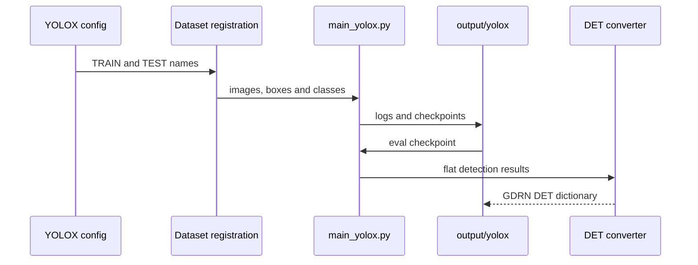
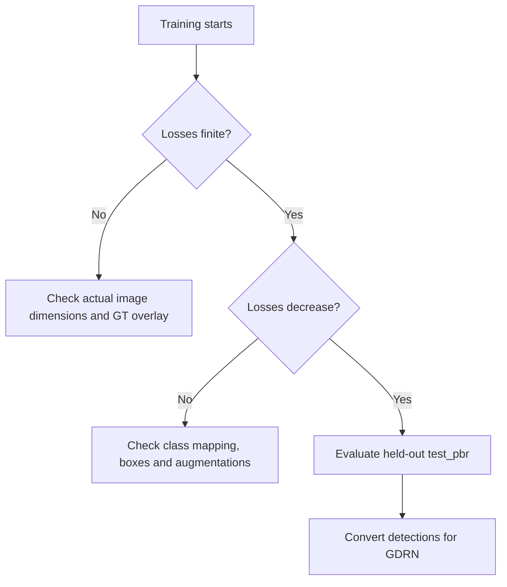

# 05 — Train / eval YOLOX

Train the detector on synthetic `mydataset` BOP data, then export detections for GDRN.

**DeepWiki:** [YOLOX training](https://deepwiki.com/DH-ai/GDRNPP/5.1-yolox-training-and-evaluation)  
**Prerequisite:** [04_custom_dataset_mydataset.md](04_custom_dataset_mydataset.md) (paths, dims, classes)



## Config

```text
src/gdrnpp/configs/yolox/bop_pbr/yolox_x_1920_augCozyAAEhsv_ranger_30_epochs_mydataset_pbr_mydataset_test_primesense.py
```

Confirm before training:

- `model.head.num_classes = 3`
- `DATASETS.TRAIN` / `TEST` names match registration (`mydataset_pbr_train` / `mydataset_pbr_test`)
- `train.init_checkpoint` points at a real `yolox_x.pth`
- Registration `height`/`width` = 1200 / 1920 (see [07](07_troubleshooting.md) for the scaling bug history)
- `output/bop/test_pbr` exists and is independent of training data

## Train

From `src/gdrnpp`, with `gdrnpp_env` active and `PYTHONPATH` set by the helper script:

```bash
cd src/gdrnpp
conda activate gdrnpp_env

bash det/yolox/tools/train_yolox.sh \
  configs/yolox/bop_pbr/yolox_x_1920_augCozyAAEhsv_ranger_30_epochs_mydataset_pbr_mydataset_test_primesense.py \
  0
```

- Arg 1: config path (relative to `src/gdrnpp`)
- Arg 2: `CUDA_VISIBLE_DEVICES` list (e.g. `0` or `0,1`)
- Extra overrides: any Detectron2 LazyConfig overrides after those args

**Current helper caveat:** `train_yolox.sh` is missing a line-continuation
backslash after `--num-gpus $NGPU`; as written, `${@:3}` executes as a separate
shell command instead of reaching `main_yolox.py`. Use the direct entrypoint
below for overrides, or fix the helper in the GDRNPP submodule first.

Equivalent entrypoint:

```bash
PYTHONPATH=. python det/yolox/tools/main_yolox.py \
  --config-file configs/yolox/bop_pbr/yolox_x_1920_augCozyAAEhsv_ranger_30_epochs_mydataset_pbr_mydataset_test_primesense.py \
  --num-gpus 1
```

### Artifacts

Checkpoints and logs land under the config’s `train.output_dir` (derived from the config path under `output/yolox/...`).

## Eval / export detections

```bash
bash det/yolox/tools/test_yolox.sh \
  configs/yolox/bop_pbr/yolox_x_1920_augCozyAAEhsv_ranger_30_epochs_mydataset_pbr_mydataset_test_primesense.py \
  0 \
  /path/to/checkpoint.pth
```

This runs `main_yolox.py --eval-only` with `train.init_checkpoint=<CKPT>`.

Convert the BOP-style results JSON into GDRN’s DET dict format before
detected-box evaluation or runtime inference
([04 § DET_FILES_TEST](04_custom_dataset_mydataset.md#6-det_files_test-format)).
GDRN training itself uses BOP pose ground truth and does not require YOLOX
detections.

## Success looks like

| Check | Expectation |
|-------|-------------|
| Loss curves | `total_loss` / cls / iou / l1 decrease over epochs; `l1_loss` finite (not `inf`) |
| GT overlay smoke | Sample train batches: boxes sit on objects (not clipped to a corner) |
| Eval JSON | Non-empty detections with sensible scores; scene/im ids match `train_pbr` |
| Class count | Predictions only for ids 1–3 (or 0–2 depending on export path — stay consistent in the DET converter) |

The first recorded working run used batch size 4, about 5.7 GB GPU memory, and
an estimated 2.5-hour detector run. Treat these as historical observations,
not capacity guarantees for another GPU or dataset size.



If boxes never align or AP stays near zero, verify image dims and that you are on a GDRNPP revision that includes the `load_anno` actual-size fix ([07](07_troubleshooting.md)).

## Next

- Pose training → [06_train_gdrn.md](06_train_gdrn.md)
