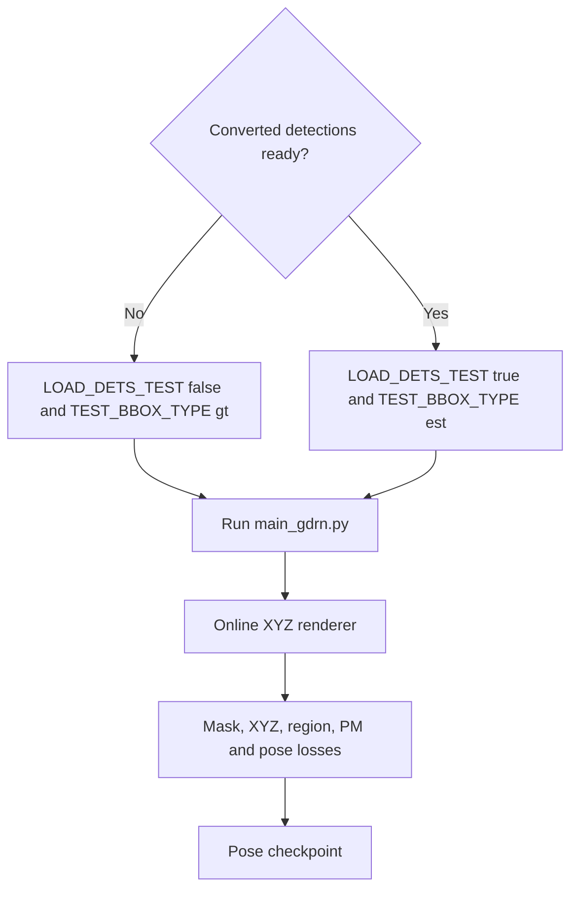
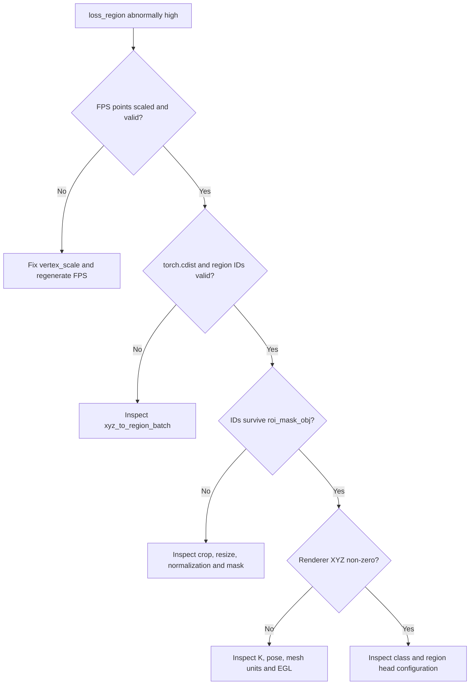
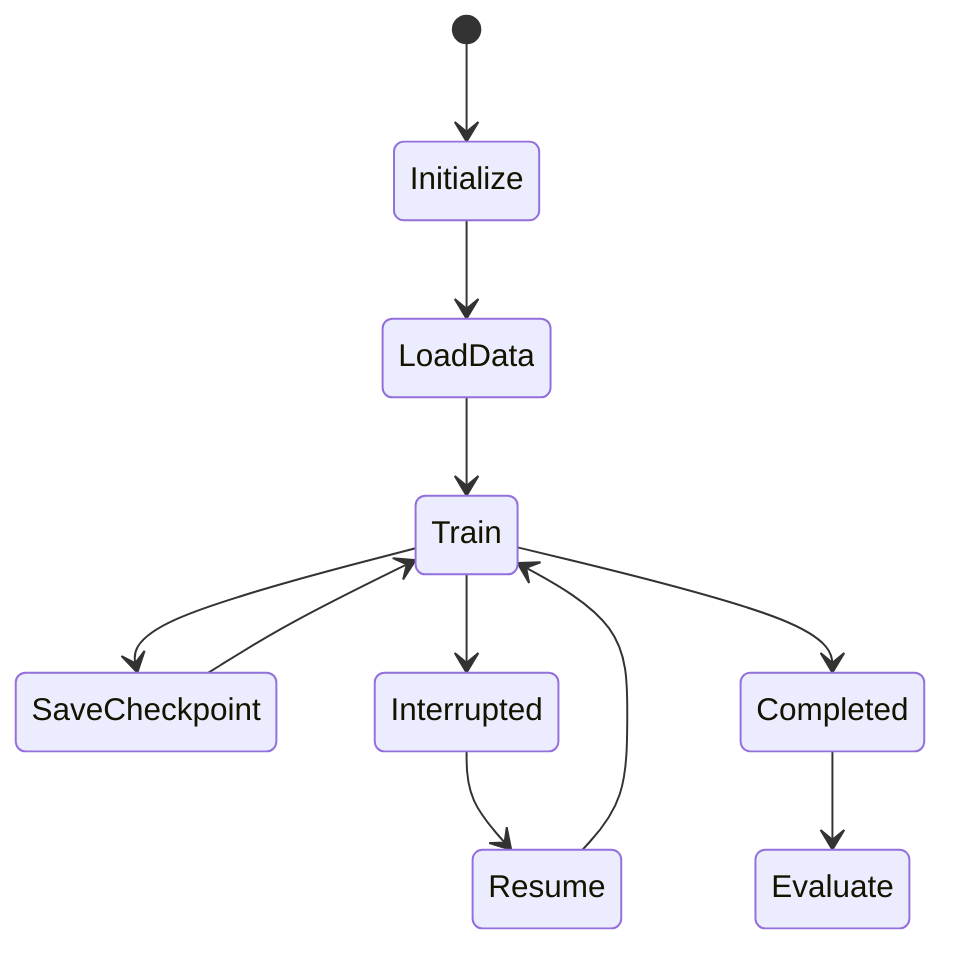

# 06 — Train / eval GDRN

Train 6D pose on `mydataset` after YOLOX (or with GT boxes for a smoke test).

**DeepWiki:** [GDRN training](https://deepwiki.com/DH-ai/GDRNPP/5.2-gdrn-training-and-evaluation)  
**Prerequisite:** [04_custom_dataset_mydataset.md](04_custom_dataset_mydataset.md)



## Config

Use the committed custom config:

```text
src/gdrnpp/configs/gdrn/mydataset_pbr/convnext_mydataset.py
```

The hb ConvNeXt config remains the upstream reference. The custom config
already uses ConvNeXt Tiny, 3 classes, 16 regions, GT test boxes and no loaded
detections. Its `DET_FILES_TEST` still points at hb and must be replaced before
enabling estimated-box testing.

Minimum edits:

- `DATASETS.TRAIN` / `TEST` → `mydataset_*` registered names
- `MODEL.POSE_NET.NUM_CLASSES = 3`
- `MODEL.POSE_NET.XYZ_ONLINE = True` (needs EGL renderer + complete `ref/mydataset.py` fields)
- `SOLVER.IMS_PER_BATCH` sized for VRAM at 1920×1200
- `DATASETS.DET_FILES_TEST` → converted JSON **or** disable dets and use GT boxes

### GT-bbox smoke (no DET file)

```bash
# Overrides use dotted keys understood by main_gdrn.py / mmcv Config
bash core/gdrn_modeling/train_gdrn.sh \
  configs/gdrn/mydataset_pbr/<your_name>.py \
  0 \
  MODEL.LOAD_DETS_TEST=False \
  TEST.TEST_BBOX_TYPE=gt
```

Base defaults live in [`configs/_base_/gdrn_base.py`](../src/gdrnpp/configs/_base_/gdrn_base.py) (`TEST.TEST_BBOX_TYPE="est"`, `MODEL.LOAD_DETS_TEST=False`).

## Train

From `src/gdrnpp`:

```bash
cd src/gdrnpp
conda activate gdrnpp_env

bash core/gdrn_modeling/train_gdrn.sh \
  configs/gdrn/mydataset_pbr/<your_name>.py \
  0
```

[`train_gdrn.sh`](../src/gdrnpp/core/gdrn_modeling/train_gdrn.sh) wraps:

```bash
PYTHONPATH=<gdrnpp root> \
CUDA_VISIBLE_DEVICES=<ids> \
python core/gdrn_modeling/main_gdrn.py \
  --config-file <CFG> --num-gpus <N> [overrides...]
```

Multi-GPU: pass `0,1` as the second argument.

### Artifacts

- Checkpoints / logs under the config `OUTPUT_DIR` (e.g. `output/gdrn/mydataset_pbr/...`)
- TensorBoard events in that tree when enabled by the trainer

## Eval

Resume / test with the same entrypoint and checkpoint overrides used by your branch (typically `MODEL.WEIGHTS=<ckpt>` or the project’s eval-only flag — match patterns in DeepWiki 5.2 and existing hb scripts). Ensure `DET_FILES_TEST` is set when `LOAD_DETS_TEST=True` and `TEST_BBOX_TYPE="est"`.

## Success looks like

| Check | Expectation |
|-------|-------------|
| Startup | Dataset dicts load; no missing `texture_paths` / `fps_points.pkl` |
| XYZ online | Renderer builds without PLY normal `IndexError` |
| Losses | Mask / XYZ / region / PM losses finite and trend down |
| Smoke poses | Qualitative overlay of predicted pose on RGB looks plausible on held-out frames |
| With DET files | Using converted `"scene_id/im_id"` JSON; empty/wrong format → no instances or crash in `dataset_utils` |

## Debug high `loss_region` systematically

A recorded run reached `loss_region ≈ 820700` while other losses improved.
The renderer and FPS distance assignment were valid; region IDs became zero
after ROI masking. Trace the first boundary where non-zero values disappear:



At each boundary log tensor shape, dtype, min/max, unique values, and non-zero
count for `roi_xyz`, `roi_fps_points`, `roi_region`, `roi_mask_obj`,
`pc_cam_tensor`, and renderer output. Remove temporary debug prints before
committing model code.

## Performance and checkpoints

The historical ConvNeXt Base run measured roughly 5.6 s/iteration over 35,000
iterations (about 54 hours). The committed custom config uses ConvNeXt Tiny to
reduce runtime. Re-evaluate rather than copying the estimate: throughput
depends on `IMS_PER_BATCH`, image resolution, `NUM_WORKERS`, `NUM_REGIONS`, GPU
and CPU data loading.



Record the config with every checkpoint. Resume only with a compatible
architecture, class count, region count, optimizer state and dataset mapping.

## Next

- Failures → [07_troubleshooting.md](07_troubleshooting.md)
