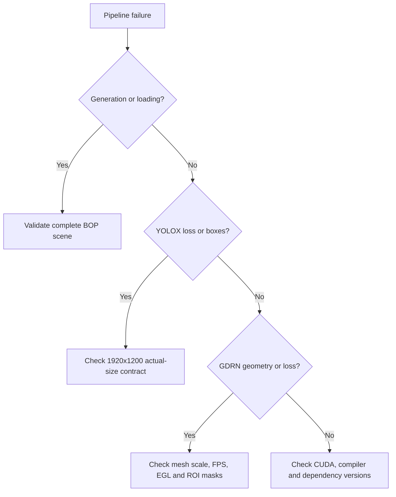
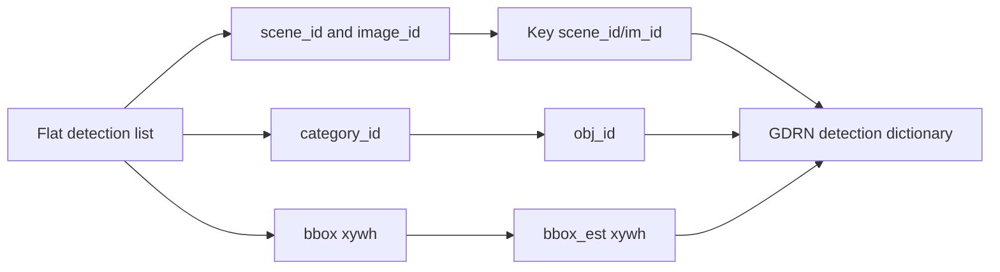
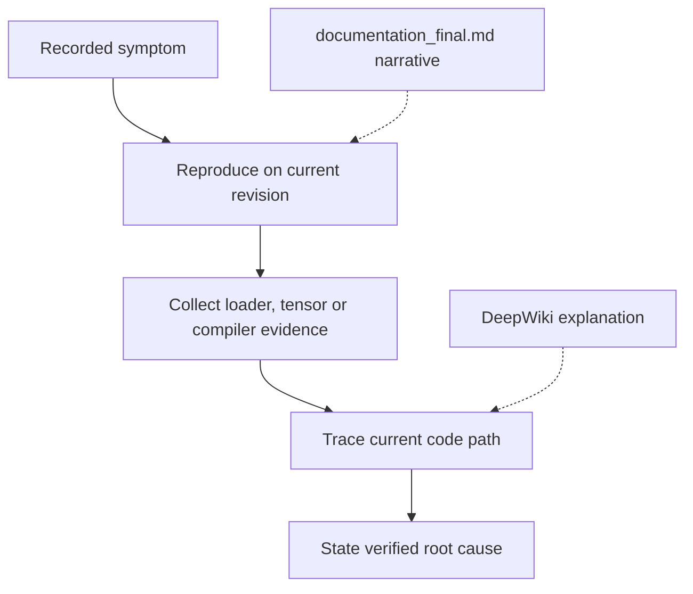

# 07 — Troubleshooting

Session-proven failures for this parent repo + GDRNPP `mydataset` path. For Ceres/CUDA/detectron2 build issues, prefer [`src/gdrnpp/troubleshoot.md`](../src/gdrnpp/troubleshoot.md).

**DeepWiki:** [Parent tooling](https://deepwiki.com/DH-ai/synthetic-data-yolo-training_and_pose_estimation/5-tooling-and-infrastructure) · [GDRNPP overview](https://deepwiki.com/DH-ai/GDRNPP/1-gdrnpp-modernized-project-overview)



## Correction vs DeepWiki: YOLOX scaling bug

Some DeepWiki pages still describe an **open** bug where YOLOX GT boxes are clipped/scaled with declared record size **960×600** while images are **1920×1200**, destroying training targets (`l1_loss=inf`, non-convergence).

**Status in GDRNPP:** fixed in `Base_DatasetFromList.load_anno` by reading the **actual** image size (PIL header) so clip/scale matches `load_resized_img()`. See commit message `fix(yolox): use actual image size for GT bbox clipping/scaling in load_anno` on the GDRNPP `main` history.

**Still do this:**

1. Set registration `height`/`width` to **1200 / 1920** in both YOLOX and GDRN `mydataset_pbr` modules.
2. Confirm your submodule pointer includes the `load_anno` fix (`git -C src/gdrnpp log --oneline --grep='actual image size'`).
3. Delete stale `.cache` dataset pickles after dim changes.

Current pitfalls are below — not the old scaling bug.

## Error table

| Symptom | Likely cause | Fix |
|---------|--------------|-----|
| YOLOX non-convergence / `l1_loss=inf` / boxes wrong | Declared dims ≠ image size; old `load_anno` | Update submodule with actual-size fix; set 1920×1200 in registration; clear cache |
| `AttributeError: module 'ref.mydataset' has no attribute 'texture_paths'` | Incomplete `ref/mydataset.py` for EGL / `XYZ_ONLINE` | Add `texture_paths=None`, `model_paths`, `vertex_scale`, `zNear`, `zFar`, `model_colors` (mirror `ref/hb.py`) |
| `IndexError` in `meshutil.calc_normals` | Blender PLY has vertices but no normals; fallback assumes triangle-soup | `python src/blenderproc_proj/add_vertext_normal.py` |
| GDRN cannot open RGB / zero images | Loader looks for `.jpg`; BlenderProc writes `.png` | Change GDRN `mydataset_pbr.py` rgb path to `.png` |
| `ref.my_dataset` / wrong attribute on `obj2id` | Typo in registration | Use `ref.mydataset` everywhere |
| DET load fails or empty instances at test | `DET_FILES_TEST` points at raw `_bop.json` / COCO GT / wrong schema | Convert to dict `"scene_id/im_id"` → list of `{obj_id, bbox_est, score, time}`; or smoke with `LOAD_DETS_TEST=False` + `TEST_BBOX_TYPE="gt"` |
| `FileNotFoundError: .../scene_gt_info.json` on generate | Partial BOP chunk from crashed run | `rm -rf src/output` then re-run BlenderProc |
| `ImportError: Unable to load EGL library` (generation) | No NVIDIA EGL on CPU host | `export LIBGL_ALWAYS_SOFTWARE=1` |
| `assert osp.exists(fps_points_path)` | Missing FPS pickle | Run/adapt FPS computation tool; place `fps_points.pkl` under `models/` |
| Wrong objects / id mismatch | `TARGET_CLASSES` ≠ `ref.mydataset.id2obj` | Align ids and names across `main.py`, `ref/`, and PLY filenames |
| `test_pbr` assertion / empty test loader | BlenderProc only generated `train_pbr` | Generate a genuinely held-out `test_pbr`; confirm which duplicate test registration won factory lookup |
| `AttributeError: ref has no attribute my_dataset` | Current GDRN model-loader typo | Change `ref.my_dataset` to `ref.mydataset` in the training checkout |
| Estimated-box test uses hb detections | Committed custom config retains hb `DET_FILES_TEST` | Replace it with converted mydataset results before enabling `LOAD_DETS_TEST=True` |
| `ValueError: Only triangular faces are supported` | PLY contains quads/n-gons | Triangulate in Blender and re-export |
| `KeyError: uint` while reading PLY | Legacy parser lacks Blender 4.2 unsigned face-index type | Use a revision with modern PLY type support or apply the verified parser mapping |
| Model dimensions near `10^-5` m | Metre PLY scaled again by `0.001` | Set the scale matching actual PLY units, verify extents, regenerate FPS |
| Dataset paths change with working directory | `relpath` or hardcoded roots disagree | Use one explicit dataset root in `ref` and every registration module |
| `loss_region` huge; regions zero after masking | ROI crop/mask preprocessing removes valid region labels | Trace renderer → ROI XYZ → region IDs → `roi_mask_obj`; see [06](06_train_gdrn.md#debug-high-loss_region-systematically) |
| YOLOX CLI overrides ignored | Missing continuation in current `train_yolox.sh` | Use direct `main_yolox.py` command or fix helper in the submodule |

## DET file conversion (minimal)

YOLOX / BOP-style list:

```json
[{"scene_id": 0, "image_id": 1, "category_id": 1, "bbox": [x,y,w,h], "score": 0.9, "time": 0.0}, ...]
```

GDRN “our format”:

```json
{
  "0/1": [{"obj_id": 1, "bbox_est": [x, y, w, h], "score": 0.9, "time": 0.0}]
}
```

Pattern implementation: `src/gdrnpp/core/gdrn_modeling/tools/*/convert_det_to_our_format.py`.



## Historical environment failures

The root `documentation_final.md` records an older AWS/GDRNPP environment.
Use these only when the traceback matches:

| Error family | Historical resolution |
|--------------|-----------------------|
| Missing `pytorch_lightning.lite` | Pin legacy Lightning (`1.6.5.post0`) or modernize the caller |
| `collections.Sequence` | Import from `collections.abc` on Python 3.10 |
| Removed NumPy aliases | Replace `np.float/int/bool` with explicit types or use a compatible pin |
| `nvcc` rejects GCC / CUDA headers conflict | Align PyTorch CUDA build, toolkit and supported host compiler |
| PLY binary encoding / `uint` | Update legacy binary detection and PLY type mapping |

These compile/import failures do not by themselves indicate a bad GPU or
driver.

## Incident evidence hierarchy



When the draft and current runtime differ, current code plus reproducible
evidence wins. The maintained YOLOX explanation is the actual-image-size fix,
not the draft’s broader “mydatabase interface” wording.

## Where to look next

| Topic | Doc |
|-------|-----|
| Generation | [02_generate_data.md](02_generate_data.md), [`AGENTS.md`](../AGENTS.md) (Cloud CPU notes) |
| Install / compile | [03_gdrnpp_submodule.md](03_gdrnpp_submodule.md), `src/gdrnpp/troubleshoot.md` |
| Dataset wiring | [04_custom_dataset_mydataset.md](04_custom_dataset_mydataset.md) |
| Architecture (external) | [Parent DeepWiki](https://deepwiki.com/DH-ai/synthetic-data-yolo-training_and_pose_estimation/1-project-overview), [GDRNPP DeepWiki](https://deepwiki.com/DH-ai/GDRNPP/1-gdrnpp-modernized-project-overview) |
| Detection↔pose contract | [`src/gdrnpp/docs/DATA_DETECTION_POSE_ARCHITECTURE_AUDIT.md`](../src/gdrnpp/docs/DATA_DETECTION_POSE_ARCHITECTURE_AUDIT.md) |
| Full local architecture | [08_architecture.md](08_architecture.md) |
