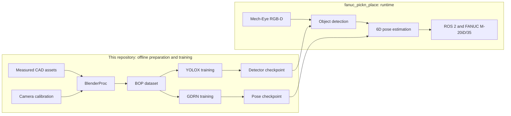
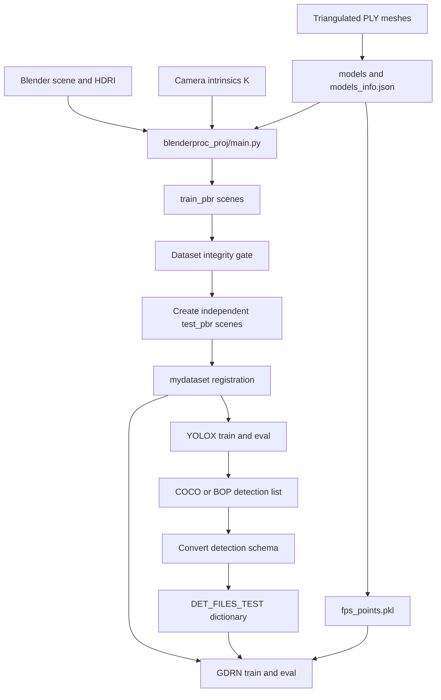
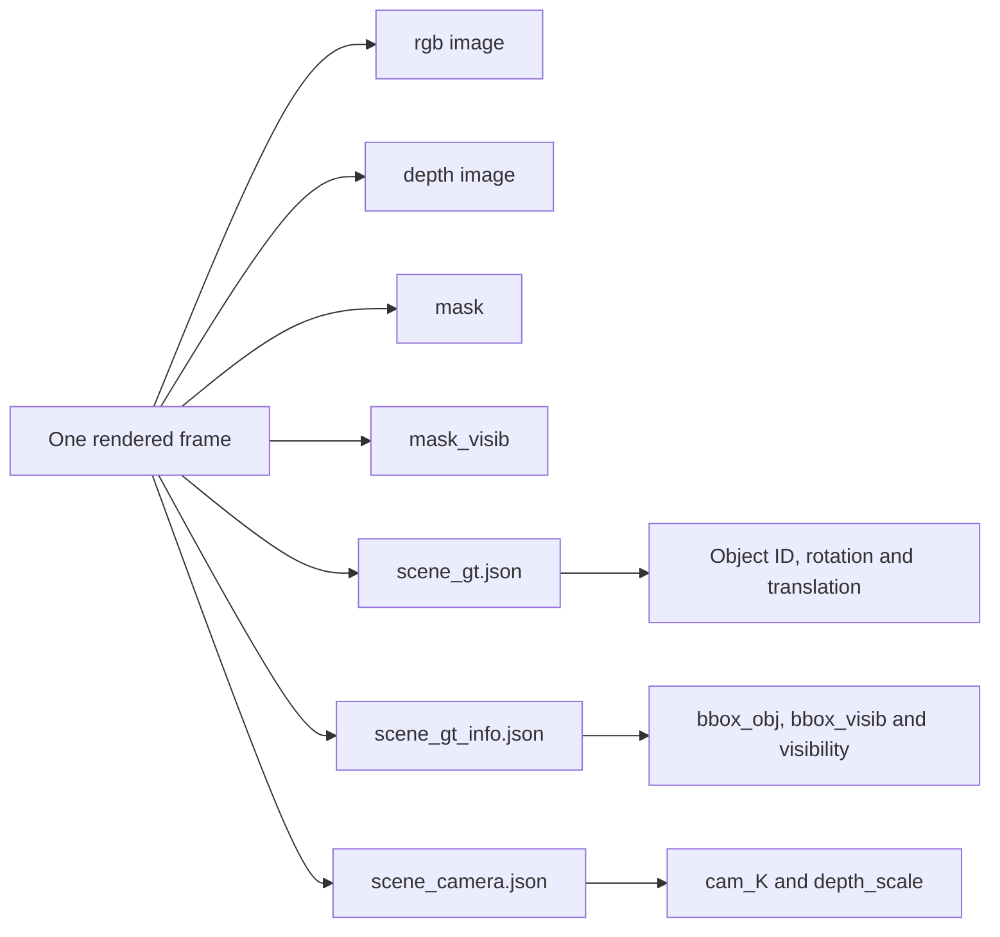
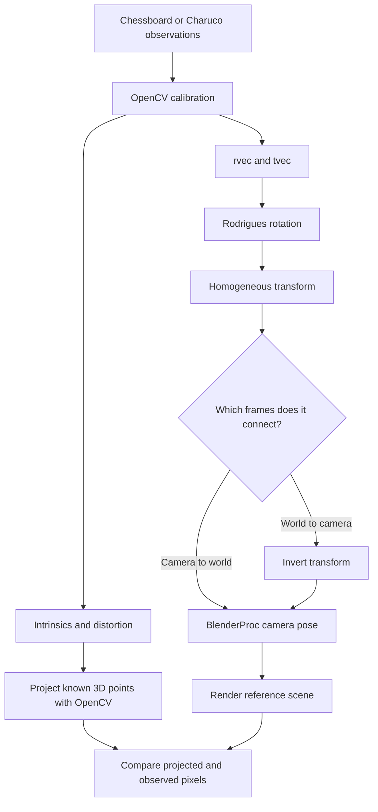
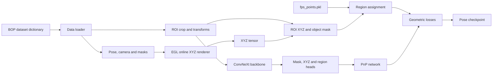
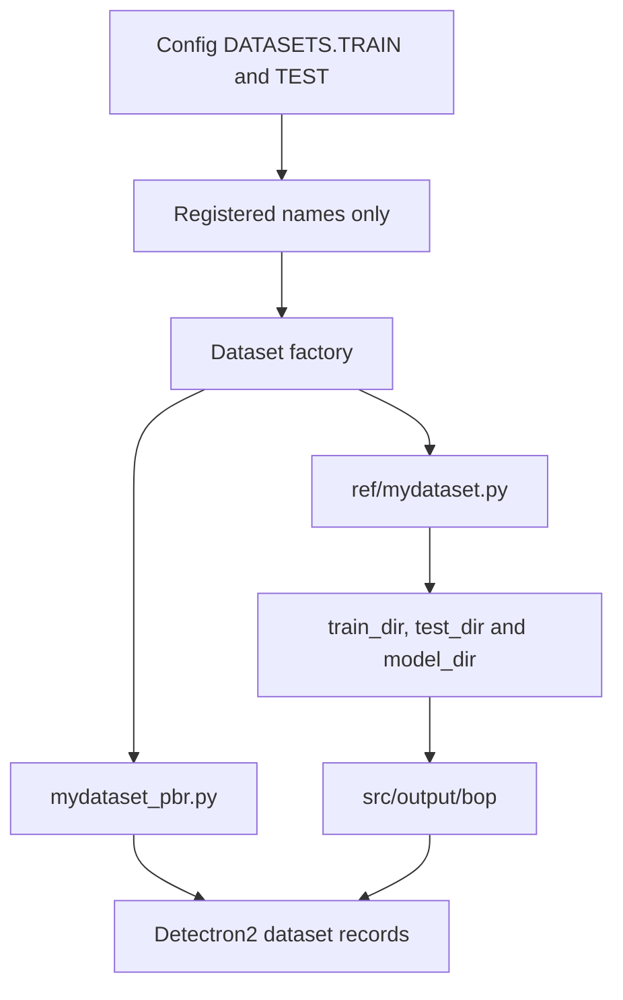
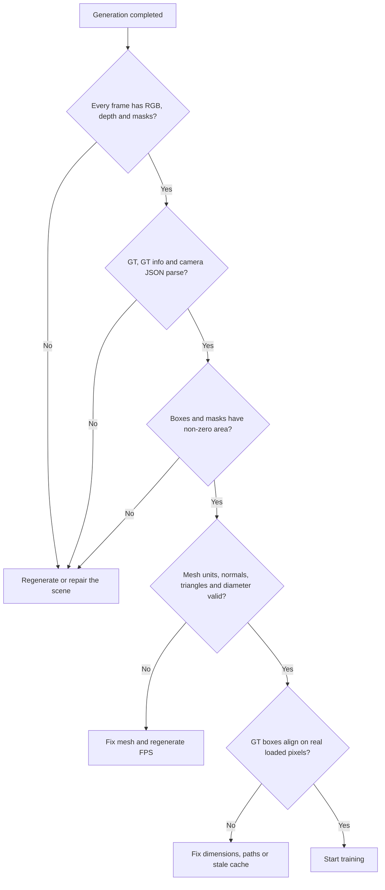

# 08 — Architecture and data contracts

This page is the local architecture map for the complete vision pipeline. The
[parent DeepWiki](https://deepwiki.com/DH-ai/synthetic-data-yolo-training_and_pose_estimation/1-project-overview)
and [GDRNPP DeepWiki](https://deepwiki.com/DH-ai/GDRNPP/1-gdrnpp-modernized-project-overview)
contain deeper code-level navigation.

## System context

The repository ends at trained weights. Robot control, MoveIt, gripper, force
sensing, and camera runtime integration belong in
[`fanuc_pickn_place`](https://github.com/DH-ai/fanuc_pickn_place).

## End-to-end artifact flow

`main.py` generates `train_pbr`; it does not create a held-out `test_pbr`
automatically. Evaluation requires scenes generated or moved into a genuine
held-out split. Do not evaluate on copied training frames and report the result
as validation.

## Contract between stages

| Artifact | Producer | Consumer | Contract |
|----------|----------|----------|----------|
| PLY meshes | CAD / Blender | BlenderProc, GDRN renderer, FPS tools | Correct units, triangular faces, supported PLY types, vertex normals |
| `models_info.json` | BOP model tooling | Dataset loader / evaluator | Object IDs aligned with filenames; valid diameter |
| Camera calibration | OpenCV / ROS camera calibration | BlenderProc and pose loader | Correct `K`, distortion handling, frame convention and depth scale |
| `train_pbr` / `test_pbr` | BlenderProc + deliberate split step | YOLOX / GDRN registrations | Complete RGB, depth, masks and scene JSON for every image ID |
| Dataset names | GDRNPP registration modules | Config `DATASETS.*` | Name maps to the intended filesystem root and object mapping |
| `fps_points.pkl` | FPS preprocessing | GDRN region supervision | Generated after final mesh scaling |
| Detection JSON | YOLOX evaluation + converter | GDRN `DET_FILES_TEST` | Dict keyed by `scene_id/im_id`, `bbox_est` in original-image `xywh` |
| Checkpoint | Trainer | Resume / inference | Same model architecture, class count and compatible config |

## BOP scene files

Bounding boxes do **not** come from `scene_gt.json`. A loader error involving a
box should be traced through `scene_gt_info.json`; camera and depth conversion
errors should be traced through `scene_camera.json`.

## Camera calibration contract

OpenCV pose estimates and BlenderProc camera poses may describe opposite
transform directions and use different axis conventions. A plausible axis
overlay is not proof of a correct calibration.

Verify marker dimensions, `K`, distortion, transform direction, and OpenCV ↔
Blender axes by projecting known 3D points. Record hand-eye calibration as
complete only when this geometric test and the robot-frame transform are
repeatable.

## GDRN training internals

YOLOX success proves only the detector path. GDRN additionally depends on mesh
scale, renderer output, FPS points, ROI transforms, masks, region labels, and
PnP supervision.

## Configuration and path resolution

Current `mydataset` files contain machine-specific absolute paths. Before
training, reconcile `ref/mydataset.py`, the GDRN registration module, and the
YOLOX registration modules. Relative paths derived from the current working
directory are not a robust substitute; use one explicit dataset root.

## Validation gates

Run the gates before a long GPU job. Assertions, `KeyError`, and
`JSONDecodeError` during loading often indicate an interrupted render rather
than a model defect.

## Historical incident status

The root [`documentation_final.md`](../documentation_final.md) is a project
incident draft, not the source of truth for current commands. In particular:

- its generic “registration/base-class mismatch” explanation for YOLOX
  `loss_l1=inf` is superseded by the verified 960×600 declared-size versus
  1920×1200 image-size failure fixed in `Base_DatasetFromList.load_anno`;
- its hand-eye sections contain conflicting “must retake” and “completed”
  statements, so completion must be confirmed from geometric evidence;
- environment and parser fixes are historical compatibility notes and may not
  apply to the current submodule revision.

Use [07_troubleshooting.md](07_troubleshooting.md) for the maintained incident
matrix.
