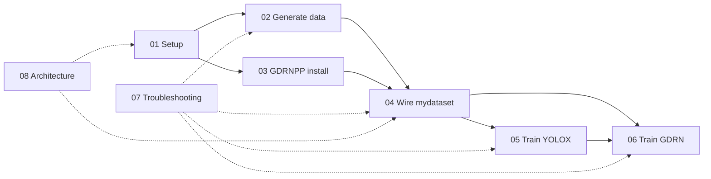

# User documentation

Command-first how-tos for this repository: synthetic BOP data (BlenderProc) → YOLOX detection → GDRN 6D pose (GDRNPP submodule).

This folder combines runnable steps, local architecture diagrams, and
session-proven pitfalls discovered while wiring a custom `mydataset`. DeepWiki
remains the deeper code-navigation reference.

| Guide | Topic |
|-------|--------|
| [01_setup.md](01_setup.md) | Clone, submodules, generation vs training environments |
| [02_generate_data.md](02_generate_data.md) | BlenderProc assets, run, BOP output, PLY normals |
| [03_gdrnpp_submodule.md](03_gdrnpp_submodule.md) | Init submodule; **CUDA / PyTorch / detectron2** install + compile |
| [04_custom_dataset_mydataset.md](04_custom_dataset_mydataset.md) | **Main how-to:** `ref/`, registration, configs, DET files |
| [05_train_yolox.md](05_train_yolox.md) | YOLOX train / eval |
| [06_train_gdrn.md](06_train_gdrn.md) | GDRN train / eval from hb template |
| [07_troubleshooting.md](07_troubleshooting.md) | Session-proven errors and fixes |
| [08_architecture.md](08_architecture.md) | System, data, artifact and model contracts |

## Architecture wikis (external)

- Parent project: [DeepWiki — project overview](https://deepwiki.com/DH-ai/synthetic-data-yolo-training_and_pose_estimation/1-project-overview)
- GDRNPP submodule: [DeepWiki — GDRNPP overview](https://deepwiki.com/DH-ai/GDRNPP/1-gdrnpp-modernized-project-overview)

## Already in the repo (do not duplicate)

- [../README.md](../README.md) — vision and high-level pipeline
- [../src/blenderproc_proj/README.md](../src/blenderproc_proj/README.md) — BlenderProc script notes
- [../docker/](../docker/) — generation container
- [../tooling/FILE_SERVER_SETUP.md](../tooling/FILE_SERVER_SETUP.md) — optional transfer helpers
- [../src/gdrnpp/docs/INSTALL.md](../src/gdrnpp/docs/INSTALL.md) — CUDA / detectron2 install
- [../src/gdrnpp/docs/ARCHITECTURE.md](../src/gdrnpp/docs/ARCHITECTURE.md)
- [../src/gdrnpp/troubleshoot.md](../src/gdrnpp/troubleshoot.md) — Ceres / CUDA / detectron2
- [../AGENTS.md](../AGENTS.md) — Cursor Cloud environment notes
