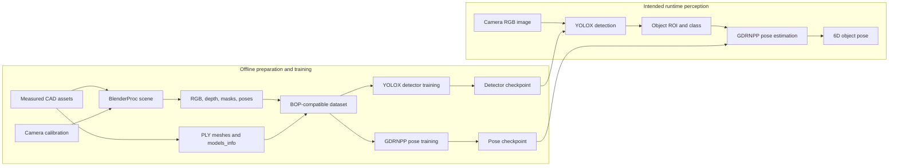
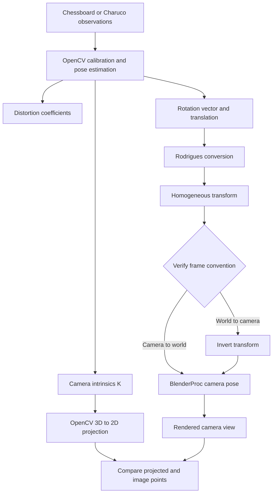
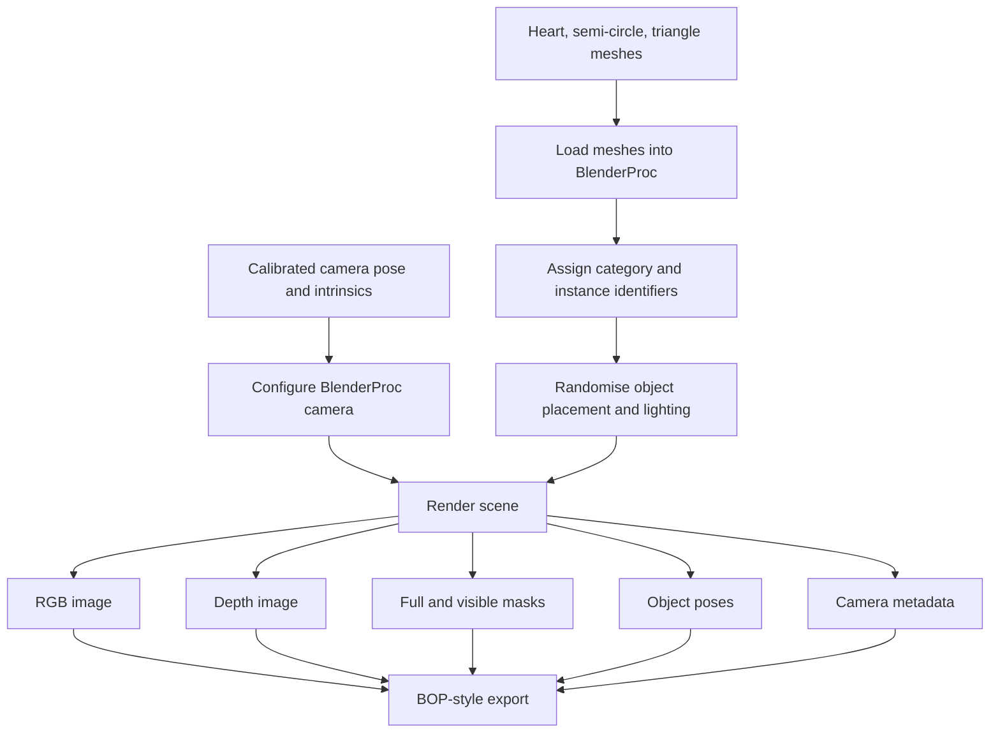
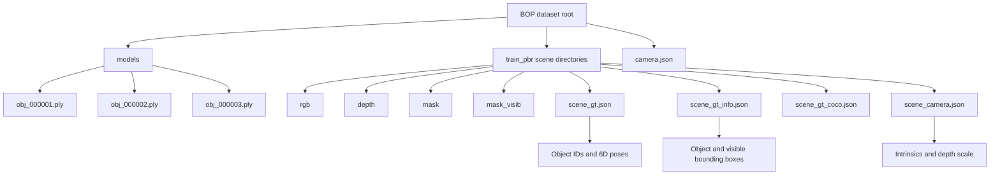
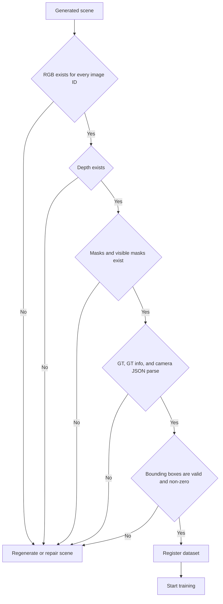
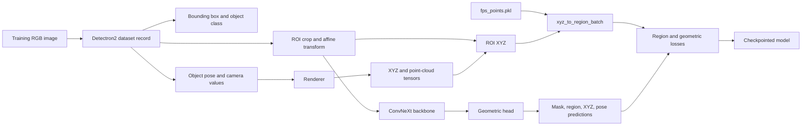
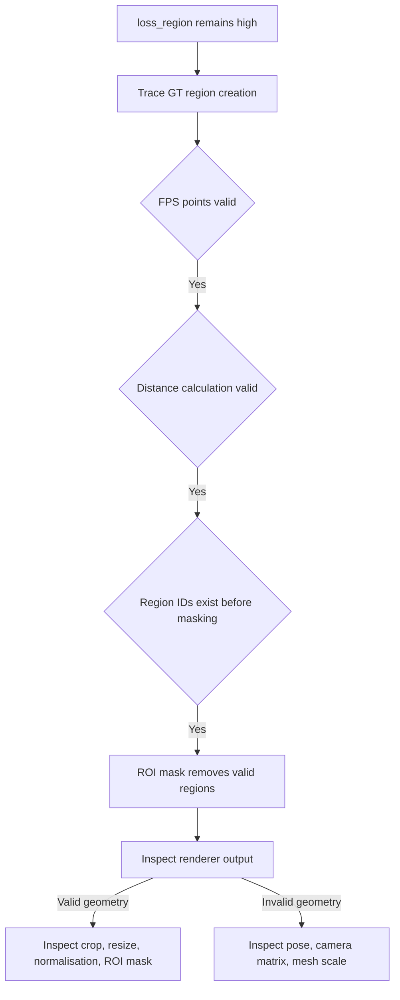
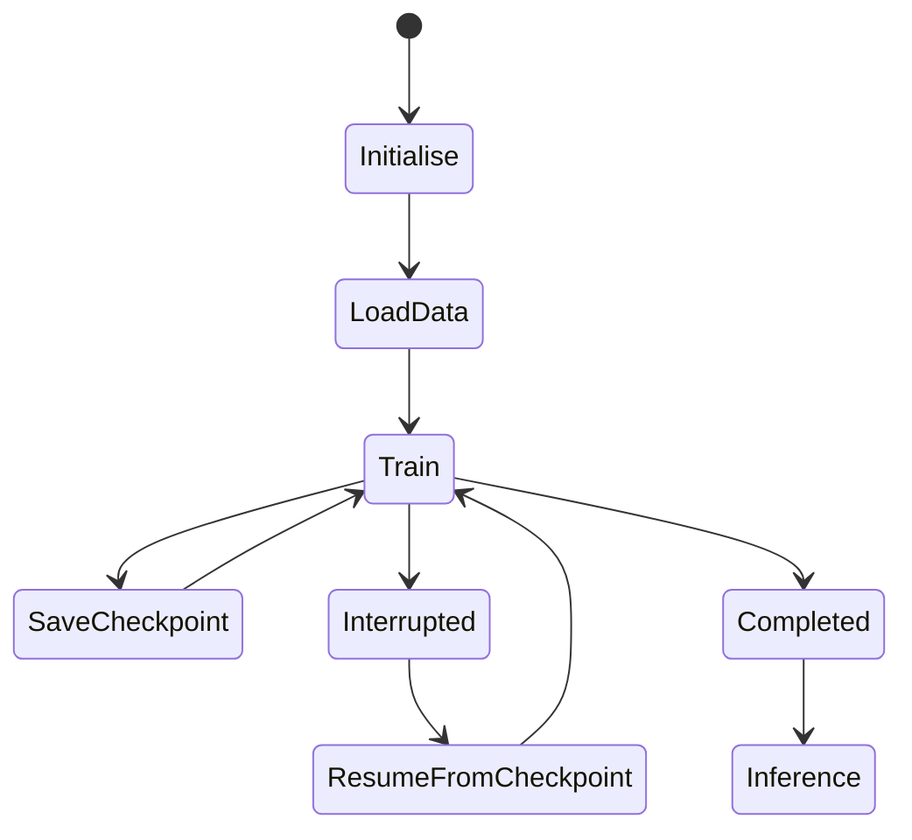
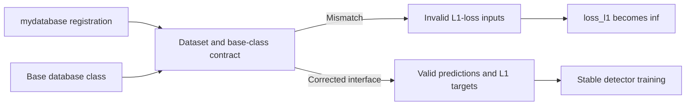

# Vision Pipeline Technical Context

## Scope

This document records the development of the perception pipeline for the Bajaj Auto robotic pick-and-place project. It covers the vision work required to identify the target parts, generate training data, train an object detector, and estimate 6D pose. It does not document robot-driver setup, MoveIt configuration, gripper control, force sensing, or production robot execution, except where camera calibration affects the perception pipeline.

The target objects are a heart, a semi-circle, and a triangle. The intended perception flow is:

```text
CAD asset preparation
    -> BlenderProc synthetic scene generation
    -> BOP-compatible dataset
    -> YOLOX object detection
    -> region-of-interest extraction
    -> GDRNPP pose estimation
    -> PnP / geometric reconstruction
    -> 6D object pose
```

The detector provides object class and image location. The pose stage uses the detected object region, mesh geometry, camera information, and pose supervision to produce the object pose required by downstream grasping and placement work.

## Vision System Boundaries and Data Flow

The vision pipeline is divided into an offline preparation and training path, followed by an intended runtime inference path. The offline path creates the assets, camera-aligned synthetic data, annotations, mesh metadata, and model checkpoints. The runtime path is intended to consume a camera image, detect the target object, restrict pose estimation to the detected ROI, and return a 6D pose.



The following artifacts form the contract between stages:

| Artifact | Produced by | Used by | Required content |
|---|---|---|---|
| PLY mesh | CAD/Blender export | Metadata generation and GDRNPP | Correct scale, triangular faces, readable PLY properties |
| Camera values | Calibration and scene configuration | BlenderProc and pose training | Intrinsics, distortion handling, pose convention, depth scale |
| BOP scene data | BlenderProc export | YOLOX/GDRNPP loaders | RGB, depth, masks, GT pose, GT information, camera data |
| Dataset registration | Custom `mydataset` integration | Detectron2/YOLOX/GDRNPP | Object mapping, split names, valid image/depth paths |
| FPS points | Custom dataset reference module | GDRNPP region supervision | Object-specific farthest-point samples |
| Checkpoints | Detector and pose training | Inference and resumed training | Model state, iteration state, compatible configuration |

## Object Geometry Preparation

The vision work began by measuring the physical parts and creating their geometry in CAD. A photograph of the heart was taken with a vernier scale, imported into FreeCAD, calibrated against the known measurement, and used to create the heart model. The resulting assets were exported for use in the synthetic-data pipeline.

This established a requirement that remained important throughout the project: object scale must stay consistent between CAD, Blender/BlenderProc, PLY export, BOP metadata, synthetic annotations, and pose-estimation training. A scale error in any one stage changes the geometry seen by the model and invalidates the pose assumptions used later in the pipeline.

## Vision Pipeline Direction

The early design work selected synthetic data generation as the way to produce both object-detection and pose-estimation data. BlenderProc was chosen to create scenes that reproduce the working environment while providing RGB images, depth images, segmentation masks, camera parameters, object poses, and training annotations.

The planned learning pipeline was defined as follows:

- Generate synthetic data for YOLO-based object detection.
- Generate BOP-compatible data for a 6D pose model.
- Train a detector to identify the known parts.
- Use GDRNPP as the primary pose-estimation direction.
- Compare or evaluate alternatives such as ICP, MegaPose, and FoundationPose after the core pipeline was operational.

The work also began tracing the GDRNPP repository to understand how custom data would be registered, loaded, and consumed by training. The purpose was not only to run an existing model but to understand how its dataset, renderer, annotation, and pose components interact.

## Camera Calibration and Pose Verification

Camera calibration was performed using a chessboard and then a Charuco board. More than one board pose and viewing angle were used. The recorded Charuco calibration result had an approximately two-percent error rate. The calibration work produced camera intrinsics and supported the extraction of camera-to-table and camera-related transformation matrices from the ROS vision environment.

At this stage, a critical validation problem was identified. A projected pose could appear correct when viewed as three axes, even when the marker dimensions, camera intrinsic matrix, or distortion coefficients were changed. Visual plausibility alone was therefore not accepted as proof that the calibration or pose was correct. The required verification method was to project known 3D points using OpenCV and compare the projected result against the image until the geometric result matched.

The following projection path was implemented and studied:

```text
CameraInfo -> PinholeCameraModel -> project3dToPixel() -> image-space validation
```

The projection node also handled an uninitialised camera model, OpenCV bridge errors, out-of-image projections, and NaN image coordinates. This work established the calibration values and geometric checks needed before configuring the same camera in BlenderProc.

The calibration-to-rendering contract is shown below. The important requirement is not merely to obtain an `R` and `t`, but to prove which coordinate frames they connect and whether the transform must be inverted before BlenderProc receives it.



The calibration values were treated as valid only after geometric checks. Marker dimensions, camera intrinsics, and distortion values can each produce a plausible axis display while still yielding an incorrect coordinate system. Projection of known 3D points was therefore used as the verification mechanism rather than visual inspection alone.

## BlenderProc Camera Configuration and First Synthetic Data

The first BlenderProc scene-generation script required the real camera pose to be expressed in BlenderProc's camera-to-world convention. OpenCV pose estimation provides rotation and translation values whose convention had to be verified before using them in Blender. The work converted the OpenCV rotation vector using Rodrigues conversion and formed the homogeneous transform:

```text
[ R11 R12 R13 Tx ]
[ R21 R22 R23 Ty ]
[ R31 R32 R33 Tz ]
[  0   0   0   1 ]
```

Two technical questions had to be resolved:

1. Whether the OpenCV pose represented the transform required directly by BlenderProc or required inversion.
2. How to convert between OpenCV and Blender coordinate conventions without introducing an axis or origin error.

The same implementation stage defined object placement, scene randomisation, lighting randomisation, and category assignment. The script generated relevant data locally with camera intrinsics and extrinsics suitable for YOLO and GDR-Net/GDRNPP work. The scene labels assigned category identifiers for the table, heart, triangle, and semi-circle.

BlenderProc segmentation output was configured to map output by `category_id`, `instance`, and `name`. Understanding BlenderProc's abstractions for mesh objects, category assignment, camera placement, segmentation, and annotation export remained necessary because the generated output had to match downstream BOP and training expectations.

The synthetic-scene generator had to produce more than detection images. It needed to preserve enough geometric information for detector training, pose training, and post-generation validation.



Object identity, object scale, camera convention, and complete rendering were all treated as required conditions. A render with correct RGB output but missing masks, depth, GT information, or camera metadata is not usable as a pose-training sample.

## Detector and Pose-Estimation Plan

The detector work moved to YOLOX, with the intention to train it on the generated images and then use its detections in GDRNPP. The pose-estimation work included testing the current images, creating a future dataset containing objects and cavities, and checking whether pose estimation remained valid when a part appeared separately in the scene.

Hand-eye calibration drift was identified as a perception risk. The proposed mitigation was to place fiducial markers, such as ArUco or AprilTags, in the workspace so that camera extrinsics can be checked or corrected dynamically. The vault records this as a proposed follow-up, not as an implemented correction.

## AWS and Legacy Environment Recovery

The GDRNPP training environment was moved onto an AWS instance. Building the repository's CUDA and C++ extensions initially failed because the 2022-era GDRNPP stack conflicted with the newer operating-system and compiler environment. The failures included old PyTorch builds depending on removed `pkg_resources` behaviour, CUDA 11.8 headers conflicting with newer system declarations, an unsupported GCC version for `nvcc`, `lib` versus `lib64` assumptions in old scripts, and compiler failures in vendored Eigen headers.

The environment work was completed by pinning compatible tool versions and patching the known broken headers. The recorded conclusion was that these failures came from toolchain version skew, not from a GPU or driver failure.

## Custom BOP Dataset Integration

The custom BlenderProc output was integrated into the GDRNPP and YOLOX training environment as a BOP-style dataset. The dataset contained the three object meshes and a `train_pbr` split with RGB images, depth images, full masks, visible masks, `scene_gt.json`, `scene_gt_info.json`, `scene_gt_coco.json`, and `scene_camera.json`.

The BOP layout was treated as a data contract rather than a collection of independent files:



A custom dataset module, `mydataset_pbr.py`, was created from the existing HB/YCBV dataset-loader pattern. Dataset registration hooks, metadata registration, Detectron2 `DatasetCatalog` registration, and YOLOX dataset-factory integration were added. The object mapping was set to heart, semi-circle, and triangle, with training and test splits named `mydataset_pbr_train` and `mydataset_test`.

`models_info.json` was generated from the PLY files. The measured model diameters were recorded as 0.04246 m for the heart, 0.03893 m for the semi-circle, and 0.04185 m for the triangle. This verified that the target objects were represented at approximately 3–4 cm scale.

Several compatibility problems were corrected during this integration.

### PyTorch Lightning version mismatch

The repository imported `pytorch_lightning.lite`, which was not available in Lightning 2.3. Lightning 2.3 was removed and `pytorch-lightning==1.6.5.post0` was installed.

### Python 3.10 import change

The legacy import `from collections import Sequence` failed in Python 3.10. It was updated to `from collections.abc import Sequence`.

### RGB image-extension mismatch

The legacy loader expected `rgb/000000.jpg`, while BlenderProc exported PNG files. The dataset loader was corrected from `.jpg` to `.png`.

### Python 2-era binary PLY detection

The binary-file utility used obsolete `unicode` handling and produced `encoding None` failures. The binary detection logic was patched so that modern Blender-generated binary PLY files could be read.

### NumPy deprecations

The legacy code used removed aliases such as `np.float`, `np.int`, and `np.bool`. These were replaced with `np.float64`, `np.int64`, and `bool` respectively.

### Blender 4.2 PLY property support

Blender exported face-index data using `uint`, but the old PLY parser did not recognise that type and failed with `KeyError: uint`. The parser was extended to support `char`, `uchar`, `short`, `ushort`, `int`, `uint`, `float`, and `double`, including the mapping `formats["uint"] = ("I", 4)`.

### CUDA launcher environment

CUDA was available in the shell but unavailable inside the YOLOX launcher. The investigation verified CUDA 11.8, Torch 2.4.1 with CUDA 11.8 support, and a visible NVIDIA A10G. The problem was traced to CUDA environment propagation, including `CUDA_VISIBLE_DEVICES`. Training later progressed beyond CUDA initialisation.

### Mesh topology requirement

The semi-circle mesh initially failed with `ValueError: Only triangular faces are supported`. The mesh contained quads or n-gons, while the GDRNPP parser accepted only triangular faces. The corrective action was to triangulate the mesh in Blender, export the updated PLY, and replace `obj_000002.ply`.

## Dataset Integrity, Path Resolution, and First YOLOX Training Run

The mesh issue and remaining PLY compatibility issues were resolved. The loader could then read the modern Blender-generated meshes.

Training still failed because synthetic rendering had been interrupted before all scenes completed. The resulting dataset contained missing RGB images, depth images, masks, and `scene_gt_info` entries, as well as malformed JSON. These defects appeared in training as `AssertionError`, `KeyError`, and `JSONDecodeError`, which initially looked like unrelated loader errors.

Integrity checks were written to compare RGB images, depth images, full masks, visible masks, `scene_gt.json`, and `scene_gt_info.json`. The checks found missing image IDs, including image 112, and incomplete frames near the ends of generated scenes. The root cause was confirmed as incomplete renderer output, not a defect in the dataset loader.

The validation procedure was subsequently used after regeneration. Its purpose is to reject incomplete scenes before a training process reaches a loader or loss function.



The data-loading path was traced from configuration through dataset registration, `DatasetCatalog`, `Base_DatasetFromList`, `pull_item()`, `load_resized_img()`, and OpenCV image loading. Dataset records were found to define the actual image and depth paths consumed by training.

The initial registration code used `osp.relpath(...)`. Because BlenderProc output and GDRNPP were located under separate project directories, the registered paths changed meaning according to the current working directory. Absolute paths were used temporarily to prove that loading worked. A permanent path-handling abstraction remained a modernization task.

After these corrections, YOLOX passed dataset loading, pretrained-weight loading, optimizer initialisation, and the start of training. Additional blockers that were resolved were a missing pretrained checkpoint, broken download links, GPU out-of-memory caused by batch size, and an API mismatch with newer Detectron2 trainer interfaces. The first documented working configuration used batch size 4, consumed approximately 5.7 GB of GPU memory, and had an estimated training time of about 2.5 hours.

## Follow-on GDRNPP Debugging — Dataset, Geometry, and Preprocessing

The later GDRNPP investigation examined the complete path from BOP annotations to model training. It verified `scene_gt.json`, `scene_gt_info.json`, `scene_camera.json`, RGB images, depth maps, masks, visible masks, XYZ data, and the generated dataset cache. The investigation clarified the distinction between `bbox_obj` and `bbox_visib`, the use of visible fractions, and the conversion of BOP annotations into Detectron2 dataset dictionaries.

The GDRNPP execution path was traced end to end:

```text
dataset
    -> dataset loader
    -> annotation conversion
    -> ROI extraction
    -> XYZ generation
    -> region-label generation
    -> ConvNeXt backbone
    -> geometric head
    -> PnP network
    -> loss computation
    -> checkpoint
```

The detector and pose model have different responsibilities. YOLOX learns object class and bounding-box localisation from the BOP-style records. GDRNPP uses the object ROI together with camera and mesh geometry to supervise XYZ, mask, region, pose, and related geometric predictions. A detector that trains correctly does not prove that the pose path is valid; the GDRNPP preprocessing, renderer, ROI masks, FPS points, and region labels must be verified independently.



`scene_gt.json` was verified as the source of object identifiers, rotations, translations, and object poses. Bounding boxes are not stored there. `scene_gt_info.json` was verified as the source of `bbox_obj`, `bbox_visib`, visible fraction, and pixel-count information. `scene_camera.json` provides the camera intrinsic matrix and depth scale, which become the camera and depth-factor values used by the loader.

Rendered bounding boxes were found to be slightly smaller than the visible object in some cases. The custom scenes contain tabletop objects with no intended occlusion, so using the same values for `bbox_obj` and the primary `bbox` was acceptable for that dataset. Where a box risked cropping object pixels, a five-to-ten percent enlargement was considered appropriate. The detector and pose pipeline were therefore examined using both the source bounding-box annotations and the ROI crop used downstream.

The annotation flow was traced as:

```text
scene_gt.json
    -> dataset registration
    -> dataset dictionary
    -> annotations
    -> transform_instance_annotations()
    -> Detectron2
    -> DataLoader
    -> read_data_train()
```

Logging was added to `__getitem__()`, dataset-dictionary creation, annotation parsing, `inst_infos`, annotation keys, image metadata, and camera information. The recorded checks confirmed that annotations, camera matrices, object poses, segmentation masks, and registration were valid at that point in the pipeline. This established that the failures being investigated occurred after successful dataset loading rather than from missing annotations.

The pose-training configuration initially attempted to replace rendered synthetic backgrounds with images from the VOC dataset. Background replacement was disabled because the rendered camera and background were fixed and the extra augmentation was not required for the synthetic dataset.

The custom dataset also required `fps_points.pkl` for farthest-point-sampling based region supervision. The reference module initially lacked `get_fps_points()`, so the associated FPS data had never been generated. `get_fps_points()`, `get_models_info()`, and `get_models()` were added to `ref/mydataset.py`, and FPS points were generated for every target object. The investigation established why farthest-point sampling is used instead of raw mesh vertices: it provides a controlled set of reference points for region prediction, PnP-related geometry, and rotation estimation. Reference-point counts such as 16, 32, 64, 128, and 256 were examined while understanding this part of the pipeline.

Mesh scaling was investigated after model dimensions appeared to be approximately `10^-5` metres. Debug output recorded minimum values, maximum values, extents, diameters, and FPS points. Blender had already exported the meshes in metres, but an additional `vertex_scale = 0.001` was applied. Setting `vertex_scale = 1` restored the expected centimetre-scale dimensions. Because `dataset.pkl` stores dataset paths and reads `fps_points.pkl` dynamically rather than storing mesh geometry, only the FPS points required regeneration after the mesh-scale correction.

The region-supervision path was then traced from renderer output through XYZ generation, ROI XYZ, FPS points, `xyz_to_region_batch()`, ROI-region creation, and cross-entropy loss. `loss_region` was observed at approximately 820700 while the other losses improved, so the supervision path—not the backbone alone—was investigated.

Debug output was added for `roi_xyz_batch`, `roi_fps_points`, `roi_mask_obj`, pairwise distances, and unique region identifiers. `torch.cdist()` and region assignment were valid: unique region identifiers existed before masking. After applying the ROI mask, the values became zero. The investigation therefore separated mask handling from region generation.

`roi_mask_obj` and `roi_xyz` were traced through `data_loader.py`, `engine_utils.py`, `engine.py`, affine crop/resize operations, and normalisation. Early ROI XYZ observations appeared to contain only zeros, which initially suggested a renderer failure. Renderer output was then inspected directly by printing camera intrinsics, pose, rotation, translation, point-cloud tensors, XYZ values, and channel-wise negative, positive, and non-zero statistics. The renderer was producing valid geometry. The remaining defect was therefore located after rendering, in ROI preprocessing or ROI-mask handling.

The region-loss investigation can be represented as a narrowing process:



### Training Performance, Checkpoints, and Configuration

The GDRNPP pose-training configuration was investigated separately from the YOLOX detector run. An observed configuration of roughly 5.6 seconds per iteration across 35,000 iterations implied an expected duration of approximately 54 hours. ConvNeXt variant, batch size, worker count, CPU throughput, GPU utilisation, image resolution, total epochs, total iterations, and region-head cost were examined to identify the source of this duration.

The backbone configuration was changed from ConvNeXt Base to ConvNeXt Tiny to reduce training time while retaining the same pipeline structure. The training configuration investigation also covered `IMS_PER_BATCH`, `TOTAL_EPOCHS`, `NUM_WORKERS`, `NUM_CLASSES`, `NUM_REGIONS`, optimizer settings, warmup, scheduler behaviour, loss weights, and bounding-box type.

Checkpoint behaviour was inspected using outputs such as `model_0004374.pth` and `model_0008794.pth`. The work covered when checkpoints are written, how to interrupt a run safely, how to resume training, and how detector and pose-estimator checkpoints are used for inference.



### Debugging Practice Applied to the Pipeline

The investigation used codebase search to trace variable creation and use for `loss_region`, `gt_region`, `roi_region`, `roi_xyz`, `renderer.render()`, `pc_cam_tensor`, `roi_mask_obj`, and `xyz_to_region_batch()`. At each boundary, the relevant tensor shapes, data types, minimum and maximum values, means, unique values, and non-zero counts were inspected. This approach was used to identify the first stage at which a valid value became invalid, rather than changing model code without evidence.

## Calibration Data and Dataset Expansion

The existing hand-eye calibration photographs were marked as unsuitable and had to be retaken. This means that camera-to-robot alignment was not considered final, even though the synthetic-data camera configuration and the vision calibration work had progressed.

New shapes and negative examples were created for model training. Further work was planned to debug generation before producing more images, register the additional dataset in GDRNPP, review detector-training results, and continue investigation of the YOLO error.

## YOLOX L1-Loss Failure

During YOLOX training, a checkpoint was saved at iteration 11,445 and then training stopped with `FloatingPointError: Loss became infinite or NaN`. The finite losses were `loss_iou = 3.484194040298462`, `loss_conf = 7.72601318359375`, and `loss_cls = 1.359397292137146`. The failing value was `loss_l1 = inf`.

The failing value is the bounding-box-refinement loss. The loss implementation was isolated in `det/yolox/models/yolo_head.py` and computes L1 loss from the selected original predictions and L1 targets. The code path responsible for scaling during augmented YOLOX forward execution was also identified in `det/yolox/models/yolox.py`.

The dataset was rechecked before changing the loss code. The integrity report found four scenes, 3,054 images, 3,054 records, and 18,324 annotations. It reported no missing RGB images, no missing depth images, no malformed bounding boxes, and no zero-area bounding boxes. The final scene contained 54 valid images; the preceding three scenes contained 1,000 images each.

The original vault entries did not record the completed fix. Subsequent project clarification confirmed that the failure was resolved. The root cause was a miscommunication between the `mydatabase` registration and the base database class. Correcting that interface restored valid L1-loss inputs and removed the `loss_l1 = inf` training failure.



## Latest Recorded Vision Work

The latest entries continue the same vision tasks: training GDRNPP and generating more synthetic data. The final daily note states that multiple errors had been resolved and that training was closer to completion.

## Confirmed Subsequent Status

The following project status was confirmed after the original vault entries were compiled:

- The YOLOX `loss_l1 = inf` failure was resolved by correcting the interface between `mydatabase` registration and the base database class.
- Stable detector training was completed.
- Hand-eye calibration was completed.
- Synthetic data was regenerated and validated.

## Remaining Engineering Work

The available notes do not yet record final completion and evaluation of the GDRNPP pose-estimation stage. The following work remains relevant for the next repository-backed documentation revision:

- Record the final GDRNPP training, validation, and pose-accuracy results.
- Replace temporary absolute-path handling with an explicit dataset-root and path-resolution design if that temporary implementation is still present in the repository.
- Preserve the completed dataset-validation procedure as a repeatable pre-training check.

## Documentation Boundary

This document is a technical-context draft for the vision pipeline. Before it is used as final external documentation, the project owner should check every technical statement against the repository, training environment, experiment outputs, and the original notes; remove any discrepancy; then add repository-specific commands, run examples, file-by-file module descriptions, and the architecture diagram from the project repository or DeepWiki. That next revision should become the usage and maintenance guide for the codebase.
