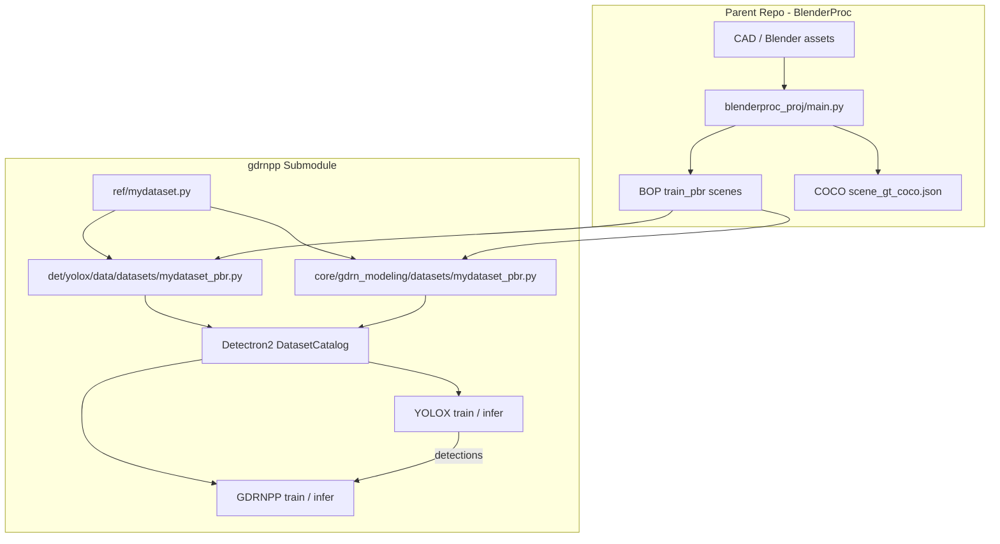
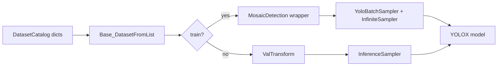
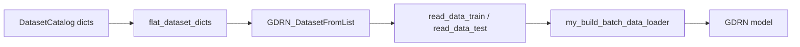

# Repository Architecture & Modernization Analysis

**Scope:** Passive code review of `synthetic-data-yolo-training_and_pose_estimation` and its `src/gdrnpp` submodule (patched GDRNPP fork). No files were executed; no git history was read.

**Date:** 2026-07-05

---

## 1. Executive Summary

This repository implements a **synthetic-data → detection → 6D pose** pipeline for industrial pick-and-place. The parent repo generates BOP/COCO datasets via BlenderProc; the **gdrnpp** submodule hosts both **YOLOX** (2D detection) and **GDRNPP** (6D pose), wired through **Detectron2** catalogs, **PyTorch**, and **MMCV**.

The codebase is functional but **architecturally rigid**: hardcoded absolute paths, duplicated dataset loaders (YOLOX vs GDRNPP), inconsistent image-dimension metadata between modules, and ad-hoc scaling hacks (`scale = 3` in inference, manual `2×` in `tooling/temp.py`). The modernization docs in `src/gdrnpp/docs/` correctly identify the direction; this report maps the current state, explains the bbox scaling bug, and proposes concrete improvements—including a path to **YOLOv11** or other detectors.

---

## 2. Top-Level Repository Layout

```
synthetic-data-yolo-training_and_pose_estimation/
├── src/
│   ├── blenderproc_proj/     # Synthetic scene generation → BOP + COCO export
│   ├── gdrnpp/               # Submodule: YOLOX + GDRNPP training/inference
│   ├── detectron2/           # Submodule: Detectron2 (dataset catalog, LazyConfig)
│   └── opencv_tests/         # Calibration, hand-eye, 6D pose visualization
├── assets/                   # CAD models, textures, YOLO dataset notes
├── docker/                   # Training container
├── tooling/                  # Ad-hoc utilities (temp.py bbox overlay, file server)
├── real_img_test/            # Real camera test images
└── output/                   # Inference outputs (e.g. coco_instances_results.json)
```

**Submodule wiring** (`.gitmodules`):

| Submodule | Path | Role |
|-----------|------|------|
| gdrnpp | `src/gdrnpp` | Detection + pose training stack |
| detectron2 | `src/detectron2` | Dataset registration, LazyConfig trainer |

---

## 3. End-to-End Data Flow



### 3.1 Synthetic data generation (BlenderProc)

**Location:** `src/blenderproc_proj/main.py`

- Renders RGB, depth, instance masks, and 6D pose labels at **1920×1200**.
- Exports standard **BOP** layout under `output/bop/`:
  - `train_pbr/{scene_id}/rgb/`, `depth/`, `mask/`, `mask_visib/`
  - `scene_gt.json`, `scene_gt_info.json`, `scene_camera.json`
  - `models/obj_*.ply`, `models_info.json`
- Object IDs aligned with `ref/mydataset.py`: heart=1, semi_circle=2, triangle=3.
- Camera intrinsics **K** match `ref/mydataset.py` (Mech-Eye calibrated values).
- Also produces COCO-format annotations for optional YOLO-native workflows.

**Tools used:** BlenderProc, OpenCV, NumPy, Blender Python API.

---

## 4. BOP Dataset Loading — Deep Dive

BOP loading is **not a single code path**. There are **two parallel implementations** that share patterns but differ in critical metadata.

### 4.1 Dataset reference layer — `ref/`

**`ref/mydataset.py`** defines the canonical dataset constants:

| Field | Value | Purpose |
|-------|-------|---------|
| `width` / `height` | 1920 / 1200 | Native image resolution |
| `camera_matrix` | 3×3 K | Intrinsics |
| `id2obj` | 1→heart, 2→semi_circle, 3→triangle | BOP obj_id mapping |
| `data_root` | Hardcoded `/mnt/data/work/.../blenderproc_proj/output` | **Fragile** |

**`ref/__init__.py`** imports all benchmark refs (`ycbv`, `lmo`, `tless`, …) plus `mydataset`.

Other `ref/*.py` files mirror this pattern for official BOP datasets (paths, K, object lists, `get_models_info()`).

### 4.2 YOLOX BOP loader — `det/yolox/data/datasets/mydataset_pbr.py`

**Class:** `MY_DATASET_PBR_Dataset`

**Registration flow:**

1. `SPLITS_MY_DATASET_PBR` dict defines split configs (`mydataset_pbr_train`, `mydataset_pbr_test`).
2. `register_with_name_cfg()` registers with **Detectron2** `DatasetCatalog` + `MetadataCatalog`.
3. Imported in `det/yolox/data/datasets/__init__.py` → side-effect registration on import.
4. Config references names: `DATASETS.TRAIN = ["mydataset_pbr_train"]`.

**Per-scene loading** (for each scene folder under `bop/train_pbr/`):

| BOP file | Usage |
|----------|-------|
| `scene_gt.json` | obj_id, cam_R_m2c, cam_t_m2c (pose) |
| `scene_gt_info.json` | bbox_visib, bbox_obj, visib_fract |
| `scene_camera.json` | cam_K, depth_scale |
| `rgb/{id}.png` | Image path |
| `depth/{id}.png` | Depth path (optional) |
| `mask/`, `mask_visib/` | Segmentation RLE |

**Detectron2 record fields:** `file_name`, `height`, `width`, `annotations[]` with `bbox` (XYWH), `pose`, `segmentation`, `model_info`, etc.

**Critical inconsistency (YOLOX split config):**

```python
# det/yolox/data/datasets/mydataset_pbr.py — SPLITS
height=600,
width=960,
```

Bboxes in `scene_gt_info.json` remain in **1920×1200 pixel coordinates**, but metadata claims **960×600**. This mismatch drives the scaling bugs documented in Section 8.

**Caching:** MD5-hashed pickle under `.cache/dataset_dicts_*.pkl` to avoid re-parsing masks.

### 4.3 GDRNPP BOP loader — `core/gdrn_modeling/datasets/mydataset_pbr.py`

Nearly identical structure to the YOLOX loader, but:

```python
# core/gdrn_modeling/datasets/mydataset_pbr.py — SPLITS
height=1200,
width=1920,
```

**Same BOP files, correct native resolution metadata.** This is the correct setting for pose training.

### 4.4 Runtime dataloader — YOLOX path

**Chain:**

```
LazyConfig (configs/yolox/bop_pbr/*.py)
  → get_detection_dataset_dicts(names=...)
  → Base_DatasetFromList (det/yolox/data/datasets/base_data_from_list.py)
  → MosaicDetection (train) / ValTransform (test)
  → build_yolox_train_loader / build_yolox_test_loader
```

**`Base_DatasetFromList.load_anno()`** scales bbox labels:

```python
r = min(self.img_size[0] / height, self.img_size[1] / width)  # uses dataset_dict height/width
res[:, :4] *= r
```

**`load_resized_img()`** scales the **actual** loaded image:

```python
r = min(self.img_size[0] / img.shape[0], self.img_size[1] / img.shape[1])  # uses real pixels
```

When `height/width` in the catalog (600×960) ≠ actual image (1200×1920), **label scale ratio ≠ image scale ratio**. Training still converges partially because both are consistently wrong in a correlated way, but evaluation and inference coordinate transforms break.

### 4.5 Runtime dataloader — GDRNPP path

**Chain:**

```
MMCV config (configs/gdrn/...)
  → dataset_factory.register_datasets()
  → core/gdrn_modeling/datasets/data_loader.py
  → core/base_data_loader.py (Base_DatasetFromList for pose)
  → DZI crop, mask/xyz loading, augmentation
```

**`core/base_data_loader.py`** handles pose-specific logic: DZI bounding-box crop, depth loading, color augmentation, mask/xyz coordinate maps, symmetry metadata from `models_info.json`.

**Detection injection:** `core/utils/dataset_utils.py` → `load_detections_into_dataset()` merges YOLOX detection JSON into pose dataset records for test-time pose (detector → crop → GDRNPP).

### 4.6 Shared libraries

| Library | Path | Role |
|---------|------|------|
| **pysixd** | `lib/pysixd/` | BOP I/O, pose transforms, misc |
| **MMCV** | external | JSON/load, config, checkpoint |
| **Detectron2** | `src/detectron2` | DatasetCatalog, LazyConfig, BoxMode |
| **mmcv** | external | File I/O, serialization |

---

## 5. YOLOX Architecture — What Is Implemented

### 5.1 Code location

All YOLOX code lives under **`det/yolox/`**, integrated with Detectron2 LazyConfig (not the standalone Megvii `yolox` CLI alone).

| Subfolder | Purpose |
|-----------|---------|
| `models/` | `YOLOX`, `YOLOPAFPN`, `YOLOXHead` |
| `data/` | Datasets, mosaic augmentation, dataloaders |
| `engine/` | `YOLOX_DefaultTrainer`, inference, predictor |
| `evaluators/` | `YOLOX_COCOEvaluator` (BOP-aware COCO export) |
| `tools/` | train, eval, export ONNX/TRT, demo |
| `exps/` | Legacy experiment configs |

### 5.2 Model structure

From `configs/yolox/bop_pbr/yolox_base.py`:

```python
model = L(YOLOX)(
    backbone=L(YOLOPAFPN)(depth=1.0, width=1.0, in_channels=[256, 512, 1024]),
    head=L(YOLOXHead)(num_classes=3, width="${..backbone.width}", ...),
)
```

**Custom mydataset config** (`yolox_x_1920_augCozyAAEhsv_ranger_30_epochs_mydataset_*.py`):

- **YOLOX-X** scale: `depth=1.33`, `width=1.25`
- 3 classes (heart, semi_circle, triangle)
- Pretrained: `pretrained_models/yolox/yolox_x.pth`
- Optimizer: **Ranger** (not SGD)
- 30 epochs, mosaic + HSV + imgaug color aug
- AMP enabled
- Batch size 4 (GPU memory constraint)

**Note:** Filename says `1920` but **`test_size` and `img_size` inherit default `(640, 640)`** from `yolox_base.py` unless overridden via CLI `opts`. Training uses `random_size=(14, 26)` × 32 → multi-scale around 448–832 px.

### 5.3 Training stack

- **Detectron2 LazyConfig** + custom `YOLOX_DefaultTrainer`
- **MosaicDetection** wrapper (4-image mosaic, mixup)
- **EMA** of weights
- **L1 loss** after mosaic phase (`no_aug_epochs`)
- Cosine LR with warmup (`flat_and_anneal_lr_scheduler`)

### 5.4 Inference stack

- `det/yolox/engine/yolox_inference.py` — batched eval loop
- `det/yolox/engine/yolox_predictor.py` — standalone single-image script (intended as `infer.py`; `tools/infer.py` is empty)
- `evaluators/yolox_coco_evaluator.py` — rescales boxes back to "original" coords before JSON export

### 5.5 What works vs what is fragile

| Works | Fragile |
|-------|---------|
| End-to-end training on synthetic BOP data | Hardcoded `/mnt/data/work/...` paths |
| Detectron2 dataset registration pattern | Duplicate dataset files (YOLOX vs GDRNPP) |
| Mosaic + strong aug pipeline | Wrong height/width in YOLOX split metadata |
| BOP evaluator with scene filtering | `ValTransform` does not return letterbox ratio |
| Real-image detection (with manual scale) | `scale=3` hack in predictor |

---

## 6. GDRNPP Architecture — PyTorch Implementation

### 6.1 Code location

**`core/gdrn_modeling/`** is the main pose stack.

| Subfolder | Purpose |
|-----------|---------|
| `models/` | `GDRN`, `GDRN_double_mask`, variants; backbones, heads, PnP |
| `datasets/` | BOP loaders (mirror of det/yolox datasets) |
| `engine/` | `GDRN_Lite` trainer (PyTorch Lightning Lite), evaluators |
| `losses/` | Coordinate CE, L2, mask, PM loss, rotation loss |
| `demo/` | `predictor_gdrn.py`, `predictor_yolo.py` |
| `tools/` | Per-dataset visualization scripts |

### 6.2 GDRN model (`core/gdrn_modeling/models/GDRN.py`)

**Architecture (GDR-Net family):**

1. **Backbone** — timm ConvNeXt / ResNet (config-driven via `BACKBONE.INIT_CFG`)
2. **Geo head** — predicts dense **XYZ coordinate maps** + **mask** (+ optional region)
3. **PnP head** — recovers 6D pose from predicted maps
4. **Losses** — mask BCE/Dice, coordinate cross-entropy, point-matching (PM) loss, rotation L2

**Input pipeline:**

- Crop object region via **DZI** (Differentiable Zoom-In) from detection bbox
- Resize to `INPUT_RES` (typically 256×256)
- Optional depth fusion (`DEPTH_BACKBONE`, `FUSE_RGBD_TYPE`)

**Output:** 6D pose (R, t) per detected object in camera frame.

### 6.3 Training engine

- **`GDRN_Lite`** extends PyTorch Lightning Lite for multi-GPU
- Uses MMCV config files (`configs/gdrn/.../*.py`) inheriting from `configs/_base_/gdrn_base.py`
- Checkpointer: `core/utils/my_checkpoint.py`
- Evaluator: `GDRN_Evaluator` / `GDRN_EvaluatorCustom` for BOP metrics

### 6.4 Two-stage inference

```
Image → YOLOX detector → bbox per object
      → GDRNPP (crop + coord map + PnP) → 6D pose
```

Demo predictors in `core/gdrn_modeling/demo/` wire this together.

---

## 7. Folder-by-Folder Scope (gdrnpp submodule)

### 7.1 `configs/`

| Subpath | Scope |
|---------|-------|
| `_base_/` | Shared MMCV/LazyConfig bases (`gdrn_base.py`, `common_base.py`) |
| `gdrn/` | Per-dataset GDRNPP configs (hb, lmo, tless, ycbv, … + ConvNeXt variants) |
| `yolox/bop_pbr/` | YOLOX LazyConfigs for BOP PBR training; `yolox_base.py` + per-dataset overrides |

**Role:** Experiment definitions only—no runtime logic. Mydataset YOLOX config: `yolox_x_1920_augCozyAAEhsv_ranger_30_epochs_mydataset_pbr_mydataset_test_primesense.py`.

### 7.2 `core/`

| Subpath | Scope |
|---------|-------|
| `base_data_loader.py` | Shared Detectron2-style dataset base (pose-oriented): DZI, depth, color aug |
| `gdrn_modeling/` | **Main GDRNPP implementation** — models, datasets, engine, losses, demo |
| `utils/` | Dataset utils, pose utils, checkpoint, logging, augment |
| `csrc/` | C++/CUDA extensions (if compiled) |

**Role:** 6D pose estimation core. This is where PyTorch training/inference for GDRNPP lives.

### 7.3 `det/`

| Subpath | Scope |
|---------|-------|
| `yolox/` | **Complete vendored YOLOX fork** adapted for Detectron2 + BOP |

**Role:** 2D object detection only. Logically separate from `core/` but shares `ref/` and `lib/`.

### 7.4 `lib/`

| Subpath | Scope |
|---------|-------|
| `pysixd/` | BOP format I/O, pose math, rendering helpers |
| `meshrenderer/`, `egl_renderer/`, `render_vispy/` | Mesh rendering for xyz map generation |
| `structures/` | Data structures |
| `torch_utils/` | LR schedulers, optimizers (Ranger), EMA, misc |
| `utils/` | FS, logging, mask utils, config helpers |
| `vis_utils/` | Visualization |

**Role:** Shared low-level utilities for both det and core. **pysixd** is the BOP ecosystem bridge.

### 7.5 `ref/`

**Role:** Static dataset metadata—paths, intrinsics, object ID maps, `get_models_info()`. **Single source of truth** intended for all loaders (but paths are hardcoded).

### 7.6 `scripts/`

| File | Scope |
|------|-------|
| `install_deps.sh` | Dependency installation |
| `init_env.sh` | Environment setup |
| `compile_all.sh` | Build native extensions |

**Role:** DevOps/setup only.

### 7.7 `tools/`

| File | Scope |
|------|-------|
| `infer.py` | **Empty placeholder** (0 bytes) |
| `merge_bop_single_obj_results.py` | BOP result merging |
| `process_bop_results_time.py` | Timing analysis |
| `remove_optim_from_ckpt.py` | Checkpoint cleanup |

**Role:** Small standalone utilities. Real inference lives in `det/yolox/engine/yolox_predictor.py`.

### 7.8 `docs/`

Modernization documentation (aligned with root `vision.md`):

| Doc | Content |
|-----|---------|
| `VISION.md`, `MODERNIZATION_PLAN.md`, `ROADMAP.md` | Goals, phases, milestones |
| `ARCHITECTURE.md` | Intended dataset/mesh flows |
| `DESIGN_DECISIONS.md` | Fork strategy, OpenPose3D boundary |
| `INSTALL*.md` | Legacy install notes (apex, horovod, tensorrt) |

### 7.9 `evaluators/`

`yolo_eval.py` — references trained checkpoint path for evaluation scripts.

### 7.10 `requirements/`

Pinned dependency list for the 2022-era stack (Detectron2, MMCV, timm, etc.).

---

## 8. Image Size & Bbox Scaling — Root Cause Analysis

### 8.1 The setup

| Layer | Resolution | Notes |
|-------|------------|-------|
| BlenderProc render | **1920×1200** | Native RGB + BOP labels |
| `ref/mydataset.py` | 1920×1200 | Correct |
| YOLOX `SPLITS` metadata | **960×600** | **Wrong** — quarter area, wrong aspect metadata |
| GDRNPP `SPLITS` metadata | 1920×1200 | Correct |
| YOLOX train `img_size` | (640, 640) default | Letterboxed square |
| GPU training choice | 960×600 effective | User reduced from full res for VRAM |

### 8.2 Why predictions need manual scaling

**Problem A — Metadata vs reality (YOLOX loader)**

In `det/yolox/data/datasets/mydataset_pbr.py`:

```python
height=600, width=960,  # catalog metadata
```

But `scene_gt_info.json` bboxes are in **1920×1200** space (e.g. `[756, 364, 85, 82]`).

During training, `Base_DatasetFromList`:

- Scales **labels** using catalog `height=600, width=960`
- Scales **images** using actual `img.shape` (1200×1920)

These produce **different scale factors** → labels and pixels disagree in network space.

**Problem B — Evaluator inverse transform uses wrong dimensions**

In `yolox_coco_evaluator.py`:

```python
scale = min(cfg.test_size[0] / float(img_h), cfg.test_size[1] / float(img_w))
bboxes /= scale
```

`img_h, img_w` come from `pull_item()` → `dataset_dict["height"], dataset_dict["width"]` → **600, 960** (wrong).

For `test_size=(640,640)`:

| | Wrong metadata | Correct (actual image) |
|--|----------------|------------------------|
| Forward scale | min(640/600, 640/960) = **0.667** | min(640/1200, 640/1920) = **0.333** |
| Inverse (÷ scale) | × **1.5** | × **3.0** |

Exported `coco_instances_results.json` bboxes are therefore ~**2× too small** vs true 1920×1200 GT.

**Evidence from your files:**

- GT (image 0): `bbox_visib: [756, 364, 85, 82]`
- Pred: `bbox: [379.3, 184.4, 40.3, 35.7]` ≈ **0.50×** GT → consistent with 2× underscale

**Problem C — `tooling/temp.py`**

```python
# Red box: raw prediction coords (too small)
cv2.rectangle(img, (x, y), (x + w, y + h), (0, 0, 255), 2)

# Blue box: manual 2× scale — closer to GT
cv2.rectangle(img, (2*x, 2*y), (2*(x + w), 2*(y + h)), (255, 0, 0), 2)
```

The `2×` blue boxes align with Problem B (evaluator used 600×960 instead of 1200×1920).

**Problem D — `yolox_predictor.py` hack**

```python
scale = 3  # Temporary scaling factor for visualization
x1, y1, x2, y2 = [int(coord * scale) for coord in [x1, y1, x2, y2]]
```

This compensates for **missing letterbox inverse transform** on raw inference:

- Full 1920×1200 image → `preproc()` with test_size 640×640 → ratio **r ≈ 0.333**
- Network outputs boxes in 640×640 letterbox space
- Correct recovery: `bbox_orig = bbox_net / r` → multiply by **~3**

Additionally, `ValTransform.__call__` **discards** the ratio from `preproc()`:

```python
img, _ = preproc(img, input_size, self.swap)  # ratio thrown away
return img, np.zeros((1, 5))  # NOT the scale ratio
```

So `predict_one()` receives a useless `ratio` and `draw_detections()` ignores proper rescaling.

### 8.3 Why "scale by 3" vs "scale by 2"

| Context | Needed factor | Reason |
|---------|---------------|--------|
| Raw inference on 1920×1200 image | **~3×** | Letterbox ratio 640/1920 = 1/3 |
| COCO JSON vs GT overlay | **~2×** | Evaluator already partially rescaled using wrong 600×960 metadata |
| Training (internal) | Inconsistent | Label/image scale mismatch masked by aug |

The user observing "scale by 3" on inference and "scale by 2" on JSON comparison is **expected** given these two separate bugs.

### 8.4 Recommended fixes (priority order)

1. **Fix YOLOX split metadata** in `det/yolox/data/datasets/mydataset_pbr.py`:
   ```python
   height=1200, width=1920,  # match GDRNPP loader and actual images
   ```
   Delete stale `.cache/dataset_dicts_*.pkl` after change.

2. **Use actual image dimensions in evaluator** — in `pull_item()`, set `img_info` from loaded image shape OR read from file header, not from potentially wrong catalog fields.

3. **Fix `ValTransform`** to return letterbox ratio:
   ```python
   img, r = preproc(img, input_size, self.swap)
   return img, r
   ```

4. **Centralize `scale_boxes_to_original()`** utility:
   ```python
   def scale_boxes_xyxy(boxes, ratio, pad=(0, 0)):
       # invert letterbox: divide by ratio, subtract padding
   ```
   Use in predictor, evaluator, and ROS inference node.

5. **Align `test_size` with training** — if training effectively uses ~960×600 content, set `test.test_size = (600, 960)` or maintain aspect-aware resize consistently in train and test.

6. **Remove hardcoded `scale=3`** from `yolox_predictor.py` once ratio pipeline is fixed.

7. **Parameterize paths** in `ref/mydataset.py` via env var (`GDRNPP_DATA_ROOT`) instead of `/mnt/data/work/...`.

---

## 9. Switching to YOLOv11 or Another Detector

### 9.1 Current coupling points

YOLOX is integrated at these boundaries:

| Integration point | File(s) | Replacement impact |
|-------------------|---------|-------------------|
| Detectron2 dataset catalog | `det/yolox/data/datasets/*` | **Reusable** — BOP→Detectron2 records stay |
| LazyConfig model definition | `configs/yolox/bop_pbr/yolox_base.py` | Replace with new model config |
| Trainer | `det/yolox/engine/yolox_trainer.py` | Replace with Ultralytics trainer OR custom loop |
| Inference → GDRNPP | `load_detections_into_dataset()` | **Format-agnostic** if output is COCO/BOP bbox JSON |
| Evaluator | `yolox_coco_evaluator.py` | Replace or wrap new detector eval |

### 9.2 Recommended migration paths

**Option A — Ultralytics YOLOv11 (lowest friction for detection only)**

1. Export BlenderProc COCO annotations (`scene_gt_coco.json`) to YOLO txt format (may already exist under `assets/yolo_dataset/`).
2. Train with `ultralytics` CLI/Python API at desired imgsz (960 or 1280).
3. Write adapter: `ultralytics_predict → BOP detection JSON` matching `load_detections_into_dataset()` schema (`scene_im_id`, `obj_id`, `bbox_est`, `score`).
4. **Leave GDRNPP untouched** — it only needs detections + BOP dataset.

**Option B — Keep Detectron2, swap model**

1. Register a Detectron2 meta-arch (e.g. RT-DETR, FCOS) in a new `det/rtdetr/` folder.
2. Reuse existing `Base_DatasetFromList` + BOP dataset registration.
3. Higher effort but preserves LazyConfig experiment tracking.

**Option C — Minimal change: fix YOLOX scaling, defer migration**

Given sim-to-real detection already works, fixing metadata/scaling may be sufficient for the demo timeline.

### 9.3 What you do NOT need to reimplement

- BOP dataset parsing (`lib/pysixd`, scene_gt loaders)
- GDRNPP pose model (`core/gdrn_modeling/`)
- BlenderProc generation pipeline
- `models_info.json` / mesh handling

---

## 10. Modernization & Architecture Improvements

Based on `docs/MODERNIZATION_PLAN.md`, `docs/ROADMAP.md`, and code review:

### 10.1 Immediate (unblock correctness)

| Item | Action |
|------|--------|
| Bbox scaling | Fix height/width metadata; return letterbox ratio |
| Path rigidity | Env-based `DATA_ROOT`; relative paths in BOP export |
| Duplicate loaders | Single `datasets/mydataset_pbr.py` imported by both det and core |
| Empty `tools/infer.py` | Symlink or delegate to `yolox_predictor.py` |
| Cache invalidation | Document `.cache/` deletion when dataset config changes |

### 10.2 Short-term (developer experience)

| Item | Action |
|------|--------|
| Dataset validator | Pre-train script: check scene_gt completeness, resolution consistency |
| Config naming | Rename `yolox_x_1920_*` → reflect actual `test_size` |
| Resolution strategy | Document train/test resolution policy (native vs downscale vs multi-scale) |
| CI smoke tests | Import catalogs, load one batch, verify bbox/image scale match |

### 10.3 Medium-term (reduce rigidity)

| Item | Action |
|------|--------|
| Detector abstraction | Interface: `DetectorBackend.predict(image) → List[Detection]` |
| Unified config | YAML/TOML for dataset root, classes, resolutions (one file) |
| Drop Detectron2 for det | Ultralytics for YOLOv11; keep Detectron2 only if needed for GDRNPP |
| Package layout | Installable `gdrnpp` pip package with `src` layout |

### 10.4 Long-term (vision docs alignment)

- **GDRNPP Modernized** stays a focused backend (per `DESIGN_DECISIONS.md`)
- Future **OpenPose3D / PoseToolkit** consumes GDRNPP as one backend among MegaPose, FoundationPose, etc.
- Do not merge robotics/ROS into this repo—keep that in `fanuc_pickn_place`

---

## 11. GPU Memory vs Resolution Strategy

Training at full **1920×1200** exceeds GPU memory; current workaround uses **960×600** metadata (incorrect) with **640×640** letterbox training.

**Better approaches:**

| Strategy | Pros | Cons |
|----------|------|------|
| **Consistent downscale at export** | Simple; all labels match images | Loses fine detail for small parts |
| **Multi-scale training** (existing `random_size`) | Good generalization | Still need correct metadata |
| **Aspect-preserving resize** (960×600 pad to 640×640) | Matches camera aspect | Requires aligned bbox transform |
| **Gradient accumulation** | Full-res batches virtually | Slower, still memory-bound |
| **Mixed precision + smaller model** (YOLOX-S/M) | Fits larger imgsz | May reduce accuracy |

**Recommendation:** Pick a **single target resolution** (e.g. 960×600), resize images + bboxes at **dataset export or load time**, store consistent metadata, and use the same resolution at inference.

---

## 12. Parent Repo Folders (outside gdrnpp)

| Folder | Scope |
|--------|-------|
| `src/blenderproc_proj/` | Synthetic data generation; BOP/COCO export; camera sync |
| `src/opencv_tests/` | ChArUco calibration, hand-eye, 6D reprojection visualizer |
| `tooling/` | Non-pipeline utilities; **`temp.py`** bbox debug overlay |
| `docker/` | GPU training container |
| `assets/` | CAD meshes, table texture, YOLO dataset notes |
| `real_img_test/` | Real Mech-Eye captures for validation |

---

## 13. Key File Reference

| Purpose | Path |
|---------|------|
| Dataset constants | `src/gdrnpp/ref/mydataset.py` |
| YOLOX BOP loader | `src/gdrnpp/det/yolox/data/datasets/mydataset_pbr.py` |
| GDRNPP BOP loader | `src/gdrnpp/core/gdrn_modeling/datasets/mydataset_pbr.py` |
| YOLOX train config | `src/gdrnpp/configs/yolox/bop_pbr/yolox_x_1920_*mydataset*.py` |
| YOLOX base config | `src/gdrnpp/configs/yolox/bop_pbr/yolox_base.py` |
| GDRNPP base config | `src/gdrnpp/configs/_base_/gdrn_base.py` |
| GDRN model | `src/gdrnpp/core/gdrn_modeling/models/GDRN.py` |
| YOLOX model | `src/gdrnpp/det/yolox/models/yolox.py` |
| Standalone inference | `src/gdrnpp/det/yolox/engine/yolox_predictor.py` |
| Bbox debug script | `tooling/temp.py` |
| Synthetic generator | `src/blenderproc_proj/main.py` |
| Modernization vision | `src/gdrnpp/vision.md`, `src/gdrnpp/docs/ROADMAP.md` |

---

## 14. Conclusion

The repository successfully connects **BlenderProc synthetic data → BOP format → YOLOX detection → GDRNPP pose**, but suffers from **2022-era research-code rigidity**: duplicated modules, hardcoded paths, and a **critical height/width metadata bug** in the YOLOX dataset split that explains the manual 2×–3× bbox scaling.

**Highest-impact fix:** Set YOLOX `SPLITS` to `height=1200, width=1920`, fix letterbox ratio plumbing, and re-export/re-evaluate. This unblocks accurate inference without magic constants.

**For YOLOv11:** Treat detection as a swappable backend; keep BOP loaders and GDRNPP core; export COCO→YOLO labels from BlenderProc and feed Ultralytics outputs into `load_detections_into_dataset()`.

The existing modernization docs (`docs/MODERNIZATION_PLAN.md`, `docs/ARCHITECTURE.md`) provide the right long-term roadmap—this report maps those intentions onto the actual code paths and identifies the concrete bugs blocking a clean coordinate pipeline.

---

## 15. Data Loading & Dataset Pipeline — Deep Dive

This section documents the full path from disk files to PyTorch tensors: conventions, tools, algorithms, and architectural layers.

### 15.1 There Is No SQL Database

The word "database" in ML repos often means **on-disk dataset + in-memory catalog**. Here:

- **Storage:** filesystem tree (BOP layout), not PostgreSQL/SQLite
- **Index/registry:** Detectron2 `DatasetCatalog` + `MetadataCatalog` (Python dict registries)
- **Cache:** pickle files under `.cache/` (dataset dicts, 3D models)

### 15.2 On-Disk Schema (BOP Convention)

After BlenderProc, each **scene** is a folder:

```text
output/bop/
├── camera.json                    # global camera (optional)
├── models/
│   ├── obj_000001.ply             # mesh per object id
│   ├── obj_000002.ply
│   ├── obj_000003.ply
│   └── models_info.json           # diameter, symmetries, bbox3d
└── train_pbr/
    └── {scene_id:06d}/             # e.g. 000000
        ├── rgb/{im_id:06d}.png
        ├── depth/{im_id:06d}.png  # uint16 depth
        ├── mask/{im_id}_{inst}.png
        ├── mask_visib/{im_id}_{inst}.png
        ├── scene_gt.json
        ├── scene_gt_info.json
        ├── scene_camera.json
        └── scene_gt_coco.json     # when calc_mask_info_coco=True
```

**Coordinate & unit conventions (BOP standard):**

| Field | Convention |
|-------|------------|
| `scene_gt[].cam_t_m2c` | Translation mm, model → camera |
| `scene_gt[].cam_R_m2c` | 3×3 rotation row-major, model → camera |
| `scene_gt_info[].bbox_visib` | `[x, y, w, h]` pixels, visible region |
| `scene_gt_info[].bbox_obj` | `[x, y, w, h]` pixels, amodal/full object |
| `scene_camera[].cam_K` | 3×3 intrinsics for that image |
| `scene_camera[].depth_scale` | Depth PNG scaling (÷ scale → mm) |
| BlenderProc export | `annotation_unit="mm"` |

**Detectron2 annotation convention** (after loader conversion):

| Field | Convention |
|-------|------------|
| `bbox` | XYWH_ABS (COCO-style) |
| `bbox_mode` | `BoxMode.XYWH_ABS` |
| `category_id` | **0-based** class index (not BOP obj_id) |
| BOP `obj_id` | 1-based (heart=1, semi_circle=2, triangle=3) |

Mapping: `cat2label = {bop_obj_id → 0..N-1}` inside `MY_DATASET_PBR_Dataset`.

### 15.3 Stage 0 — Synthetic Write (BlenderProc)

**Tool:** BlenderProc `bproc.writer.write_bop()`

**Algorithm / processing at write time:**

1. Render RGB + depth + instance maps via Blender Cycles/Eevee
2. Post-render CPU adjustments: exposure jitter, Gaussian noise (`apply_image_adjustments`)
3. BOP writer computes:
   - 6D poses per instance → `scene_gt.json`
   - Visible/amodal bboxes, pixel counts → `scene_gt_info.json`
   - Per-frame intrinsics/extrinsics → `scene_camera.json`
   - Optional COCO instances → `scene_gt_coco.json` (`calc_mask_info_coco=True`)

**Not written by default in current script:** `coor_backprj/*.pkl` (GDRNPP expects these for offline XYZ maps — must be generated separately or via `XYZ_ONLINE` mode).

### 15.4 Stage 1 — Catalog Registration (Import-Time Side Effects)

**Tools:** Detectron2 `DatasetCatalog`, `MetadataCatalog`, MMCV

**Architecture pattern:** Registry + lazy callable

```python
DatasetCatalog.register(name, MY_DATASET_PBR_Dataset(cfg))  # callable
MetadataCatalog.get(name).set(ref_key=..., objs=..., evaluator_type="bop", ...)
```

**Two independent registration trees:**

| Tree | Factory | Import trigger |
|------|---------|----------------|
| YOLOX | `det/yolox/data/datasets/dataset_factory.py` | `from det.yolox.data.datasets import register_with_name_cfg` in `__init__.py` |
| GDRNPP | `core/gdrn_modeling/datasets/dataset_factory.py` | Called explicitly via `register_datasets()` at train startup |

Both duplicate nearly identical `mydataset_pbr.py` modules — same parsing logic, different `height/width` in SPLITS.

### 15.5 Stage 2 — Index Build (`MY_DATASET_PBR_Dataset.__call__`)

**Triggered when:** `get_detection_dataset_dicts(["mydataset_pbr_train"])` first accesses the catalog.

**Tools:** MMCV (JSON I/O), NumPy, `transforms3d` (quat), `lib.pysixd.misc`, `lib.utils.mask_utils`

**Algorithm (per scene, per image, per instance):**

```
FOR each scene_dir in sorted(train_pbr/*):
  LOAD scene_gt.json, scene_gt_info.json, scene_camera.json
  FOR each image_id in scene_gt:
    BUILD image-level record {file_name, height, width, cam, depth_factor, scene_im_id, ...}
    FOR each instance in scene_gt[image_id]:
      FILTER by obj_id in selected objs
      COMPUTE pose matrix R|t  (t_mm / 1000 → meters)
      COMPUTE centroid_2d = project(t, K)
      READ bbox_visib from scene_gt_info
      FILTER if w<=1 or h<=1
      READ mask_visib PNG → binary_mask_to_rle()  [COCO RLE compression]
      READ mask PNG → mask_full RLE
      ATTACH model_info from models_info.json
      ATTACH bbox3d_and_center from cached PLY
      APPEND to annotations[]
    IF annotations empty: SKIP image
    APPEND record to dataset_dicts[]
CACHE dataset_dicts → .cache/dataset_dicts_{hash}.pkl
```

**Key algorithms:**

- **`binary_mask_to_rle`:** COCO run-length encoding via `pycocotools`-compatible format
- **`mat2quat` / `quat2mat`:** `transforms3d` rotation conversions
- **`misc.get_bbox3d_and_center`:** 3D AABB from mesh vertices
- **`misc.get_symmetry_transformations`:** discrete/continuous symmetry expansion for pose eval

**Memory design:** Only **lightweight** dicts cached (paths + RLE masks), not full RGB tensors.

### 15.6 Stage 3A — YOLOX Runtime Pipeline



#### 3A.1 `Base_DatasetFromList.pull_item()`

**Per sample:**

1. **Load image:** `read_image_mmcv(path, BGR)` via MMCV
2. **Resize image:** `r_img = min(img_size/H_actual, img_size/W_actual)` → OpenCV `INTER_LINEAR`
3. **Load labels:** convert each anno bbox XYWH → XYXY, clip to `[0,width]×[0,height]`
4. **Scale labels:** `r_lbl = min(img_size/H_meta, img_size/W_meta)` → multiply bbox coords

**Bug:** `H_meta/W_meta` from catalog (600×960) ≠ `H_actual/W_actual` from file (1200×1920) → `r_img ≠ r_lbl`.

5. **Preproc:** `TrainTransform` or `ValTransform`:
   - **`preproc()` algorithm:** letterbox resize + pad with gray 114 to square `input_dim`
   - Returns ratio `r` internally but **ValTransform discards it**

#### 3A.2 `MosaicDetection` (train only)

**Algorithms:**

| Aug | Method |
|-----|--------|
| Mosaic | Stitch 4 random images into 2× canvas, paste with coordinate remap |
| Random affine | `random_affine()` — rotation, scale, shear, translation (OpenCV warp) |
| MixUp | Blend two mosaics with `β ~ Beta` |
| HSV jitter | `augment_hsv()` — multiplicative hue/sat/value |
| Color aug | imgaug pipeline (eval'd from config string) or Albumentations |

**Sampler:** `InfiniteSampler` — infinite epoch-less iteration (YOLOX style).

**Batching:** `YoloBatchSampler` supports dynamic `input_dim` changes each epoch (`random_resize` in trainer multiplies by 32).

#### 3A.3 Eval inverse transform

`YOLOX_COCOEvaluator.convert_to_coco_format_bop()`:

```python
scale = min(test_size[0]/img_h, test_size[1]/img_w)  # img_h,w from catalog metadata
bboxes /= scale  # map network coords → "original" image coords
bboxes = xyxy2xywh(bboxes)
```

Uses `info_imgs` from `pull_item()` which passes **catalog** height/width, not file dimensions.

### 15.7 Stage 3B — GDRNPP Runtime Pipeline



#### 3B.1 Flattening (`flat_dataset_dicts`)

**Unique to GDRNPP train path:**

Converts one image dict with N annotations → N dicts each with single `inst_infos`:

```python
# Before: {file_name, annotations: [inst0, inst1, ...]}
# After:  [{file_name, inst_id, inst_infos: inst0}, {..., inst_infos: inst1}, ...]
```

**Why:** GDRNPP trains **one ROI per forward pass** (single object pose), not full-scene multi-object like YOLOX.

YOLOX keeps image-level dicts with all annotations; GDRNPP flattens at dataloader init (`flatten=True` for train).

#### 3B.2 `GDRN_DatasetFromList.read_data_train()` — Core Algorithms

**Tools:** OpenCV, Detectron2 transforms, MMCV, custom warp utils

**Step-by-step:**

| Step | Algorithm | Purpose |
|------|-----------|---------|
| 1 | `read_image_mmcv` | Load full-resolution BGR |
| 2 | Depth load | `mmcv.imread / depth_factor` → meters; optional `misc.backproject` → XYZ |
| 3 | Background replace | Composite random VOC/SUN bg using mask (`replace_bg`) — domain randomization |
| 4 | Color aug | imgaug / ROI10D / Albumentations (prob-gated) |
| 5 | `ResizeShortestEdge` | Detectron2 geometric aug on full image; **scales cam K** accordingly |
| 6 | Load XYZ | Pickle from `coor_backprj/{im}_{inst}.pkl` → paste crop into full-size coord map |
| 7 | **DZI** (`aug_bbox_DZI`) | Sample enlarged square crop around bbox (uniform/truncnorm shift+scale) |
| 8 | **`crop_resize_by_warp_affine`** | Affine warp: full image → `INPUT_RES×INPUT_RES` (256) ROI |
| 9 | Mask/xyz crop | Same warp at `OUTPUT_RES` (64) for head targets |
| 10 | `get_2d_coord_np` | Normalized UV grid (0–1) as extra input channel |
| 11 | Normalize | `(pixel - mean) / std` → [0,1] range |

**DZI (Differentiable Zoom-In) — key geometric algorithm:**

```
Given bbox_xyxy, image H×W:
  center = (cx, cy) + random_shift * bbox_size
  scale = max(bh, bw) * (1 ± dzi_scale_ratio) * pad_scale
  crop_resize_by_warp_affine(image, center, scale, 256)
```

At **test time**, DZI uses detector bbox (from YOLOX JSON via `load_detections_into_dataset`) without random augmentation.

#### 3B.3 Detection injection bridge

`load_detections_into_dataset()` merges precomputed detections:

```python
# Input: JSON keyed by scene_im_id → [{obj_id, bbox_est, score}, ...]
# Replaces annotations[] with detection proposals
# Filters: score_thr, top_k_per_obj, train_objs, selected_scenes
```

This is the **glue** between YOLOX output and GDRNPP input at inference.

#### 3B.4 GDRNPP batching

- `TrainingSampler` or `RepeatFactorTrainingSampler`
- `my_build_batch_data_loader` → `trivial_batch_collator` (list of dicts, not stacked tensor batch)
- Model/engine handles variable ROI batching internally

### 15.8 Caching Layer Architecture

| Cache file | Content | Invalidation |
|------------|---------|--------------|
| `.cache/dataset_dicts_{name}_{hash}.pkl` | Parsed Detectron2 dicts | Hash includes objs, paths, mask flags |
| `models/models_{name}.pkl` | Parsed PLY vertices + bbox3d | Per dataset name |
| BOP `coor_backprj/*.pkl` | Precomputed XYZ crops | Per instance |

**Risk:** Stale cache after changing `height/width` in SPLITS — must delete manually.

### 15.9 Tool & Library Stack Summary

| Layer | Libraries |
|-------|-----------|
| Synthetic write | BlenderProc, Blender, NumPy, OpenCV |
| File I/O | MMCV, imageio, OpenCV, JSON |
| BOP math | `lib.pysixd` (poses, misc, inout), `transforms3d` |
| Masks | `pycocotools.mask`, custom RLE in `mask_utils` |
| Registry | Detectron2 `DatasetCatalog`, `MetadataCatalog`, `BoxMode` |
| Config | MMCV Config (GDRNPP), OmegaConf LazyConfig (YOLOX) |
| Image aug | imgaug, Albumentations, Detectron2 transforms, custom Mosaic |
| Geometry | OpenCV warpAffine, custom `crop_resize_by_warp_affine` |
| 3D models | PLY via `pysixd.inout.load_ply` |
| Training I/O | PyTorch `DataLoader`, custom samplers |
| Distributed | Custom `my_comm`, Detectron2 `InferenceSampler` |

### 15.10 Architectural Conventions (Mental Model)

1. **Three representation layers:**
   - **Disk (BOP):** scene-centric JSON + PNG, mm poses, pixel bboxes
   - **Catalog (Detectron2 dict):** image-centric, paths + RLE + 0-based labels
   - **Tensor (model input):** letterboxed (YOLOX) or DZI-cropped (GDRNPP)

2. **Two granularity modes:**
   - **Image-level** (YOLOX): all objects per image, multi-box targets
   - **Instance-level** (GDRNPP train): one object per `__getitem__`

3. **Lazy vs eager:**
   - Catalog build = eager (once, cached)
   - Pixel load = lazy (every epoch, every worker)

4. **Separation of concerns (intended):**
   - `ref/` = constants
   - `*/datasets/mydataset_pbr.py` = BOP → dict parsing
   - `*/data_loader*.py` = dict → tensor
   - `configs/` = hyperparameters only

5. **Where rigidity comes from:**
   - Hardcoded absolute paths in `ref/` and dataset modules
   - Duplicated parsers (det vs core)
   - Inconsistent `height/width` between duplicated parsers
   - Magic scale hacks instead of explicit coordinate transform objects
   - Missing `coor_backprj` generation in BlenderProc export path

### 15.11 Recommended Pipeline Hardening

1. **Single source of truth for resolution:** read H/W from first RGB file at catalog build, store in dict
2. **Explicit `CoordinateTransform` class:** letterbox ratio, DZI params, original K — serializable with predictions
3. **Unified `datasets/bop/` module:** one parser imported by both det and core
4. **Dataset validator script:** check scene_gt keys match files, bbox within bounds, H/W consistency
5. **Generate or online-compute `coor_backprj`** before GDRNPP training
6. **Env-based roots:** `GDRNPP_DATA_ROOT`, `BOP_DATASET_ROOT` — no `/mnt/data/work/...`
